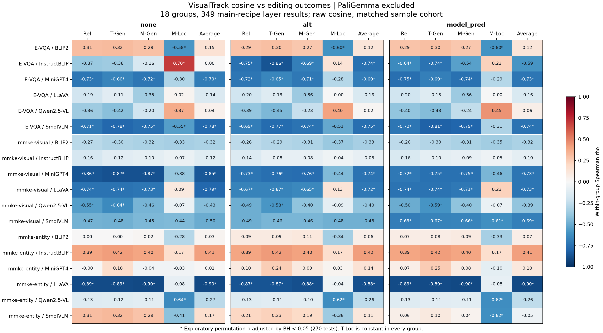

# 三版视觉表征相似度与真实编辑效果的分指标分析（排除 PaliGemma）

本分析使用 [SWeeplayers.md](SWeeplayers.md) 当前链接的 **2026-09-28T11:10:16+08:00** 扫层快照，完成日期为 2026-09-29。所有 PaliGemma 记录均排除；只比较 main 配方。共 **18 个模型×数据集组合、349 条逐层实测结果**。结果反映这份冻结台账，不代表此后服务器新增的扫层结果。

**主要发现：有相关性，但当前最明确的是若干组合中的负相关，而非相似度越高、Rel/Gen 越好。** 三版的组内 Rel/T-Gen/M-Gen 相关系数跨组合均值约为 −0.29 至 −0.33；没有经本次多重比较校正后显著的 Rel/Gen 正相关。内部峰附近存在一个局部正例，但样本覆盖不足，尚不支持通用选峰规则。

## 1. 比较的对象与统计口径

- none：图文提示结束处的预测位置，与同层视觉 token 平均表征求余弦。
- alt：新答案全部有效预测位置的余弦在样本内平均，再对样本等权平均。
- model_pred：原始图文输入对应的模型历史完整输出缓存，按全部可用答案预测位置同样聚合。缓存若曾截断，不补造后续文本。
- alt/model_pred 不是仅首 token，也不是读完答案 token 之后的状态；预测 y_t 使用位置 P−1+t。这里比较的是表征相似度，不是新旧梯度之间的方向余弦。
- 主分析用 `matched_gradient`，三版使用同一组可比样本；只有 BLIP2×MMKE-entity 为 284/636（44.65%），其余组合的样本覆盖率均不低于80%（例如BLIP2×E-VQA为465/500），并非全部100%。另做 `available_train` 敏感性分析，该口径下 BLIP2×MMKE-entity 的 none/alt 为 636，model_pred 仍为 284，不能称为三版同样本比较。
- 在每个模型×数据集内，将完整相似度曲线与实测层交集对齐，计算 Spearman ρ。没有把不同模型的原始分数混在一起算单个相关系数。下文“平均ρ”是18个组内ρ的等权算术均值，不是合并样本的ρ。
- 主分析保留 raw 有符号余弦；未因编辑分数高低删除层。另报告余弦分数的 Tukey κ=1 敏感性分析，与 LGA 梯度分数的异常层过滤不是同一对象。
- 按层进行 19,999 次双侧随机置换，固定种子 20260929；270 个可计算的主检验统一做 BH 校正。层之间存在结构依赖，且扫层集合并非随机抽样，因此 p/q 仅为探索性指标，不能当成独立留出验证或因果证据。
- 对两变量的秩分别回归层号秩，再计算残差相关，作为控制层深的一阶诊断；不等于排除所有非线性架构因素。若相似度秩与层号秩完全重合，残差方差为零，偏相关记“—”。
- Rel 是编辑可靠性，T-Gen 是文本改写泛化，M-Gen 是图像改写泛化，T-Loc/M-Loc 是文本/图像局部性。Average 沿用五项均值，保留台账历史舍入值。相关性分析的观测单位是“层”，不是349个独立训练种子，也不是逐样本编辑成功率。

## 2. 三版与各项指标的总体关系

| 指标 | none 平均ρ | alt 平均ρ | model_pred 平均ρ | 正相关组数 none/alt/model_pred | q<.05 正相关组数 |
|---|---|---|---|---|---|
| Rel | -0.302 | -0.302 | -0.328 | 4 / 5 / 5 | 0 / 0 / 0 |
| T-Gen | -0.292 | -0.300 | -0.321 | 5 / 5 / 5 | 0 / 0 / 0 |
| M-Gen | -0.286 | -0.295 | -0.318 | 4 / 5 / 5 | 0 / 0 / 0 |
| M-Loc | -0.156 | -0.184 | -0.188 | 5 / 5 / 4 | 1 / 0 / 0 |
| Average | -0.276 | -0.297 | -0.312 | 7 / 6 / 5 | 0 / 0 / 0 |
| T-Loc | — | — | — | 0 / 0 / 0 | 0 / 0 / 0 |

T-Loc 在全部349条主分析记录里均为100，故54个对应检验的ρ未定义，不能解释为ρ=0。Rel/Gen 的均值呈弱负相关，部分单组则很强；负相关意味着相似度高的实测层通常编辑分数更低。本文仅用 |ρ|≥0.6 标识较强关联，用于描述而非普适显著性阈值。

## 3. 相关性具体出现在哪里

| 数据集 | 模型 | 版本 | 层数 | Rel ρ | T-Gen ρ | M-Gen ρ | 控制层深后 Rel/T-Gen/M-Gen |
|---|---|---|---|---|---|---|---|
| mmke-visual | MiniGPT4 | none | 21 | -0.857 | -0.873 | -0.873 | -0.629 / -0.632 / -0.634 |
| evqa-pilot500 | InstructBLIP | alt | 15 | -0.745 | -0.861 | -0.686 | -0.723 / -0.851 / -0.663 |
| mmke-entity | LLaVA | model_pred | 10 | -0.891 | -0.891 | -0.900 | — / — / — |
| evqa-pilot500 | SmolVLM | model_pred | 20 | -0.722 | -0.808 | -0.792 | -0.385 / -0.535 / -0.498 |
| mmke-entity | InstructBLIP | alt | 23 | 0.394 | 0.423 | 0.402 | -0.144 / -0.103 / -0.136 |

这些案例在结果计算后选取，用于展示正负方向与控制层深的差别，并非独立确认集。完整54组结果见后文。

**强负相关且控制层深后仍保留的例子**：MiniGPT4×MMKE-visual 的 none，与 T-Gen/M-Gen 均约 −0.873，控制层深后仍约 −0.63；InstructBLIP×E-VQA 的 alt 与 T-Gen 为 −0.861，控制层深后为 −0.851。这些关系不能简单归结为一个共同的单调深度趋势。

**强相关但与层深混在一起的例子**：LLaVA×MMKE-entity 的 none/model_pred 在已测10层上，相似度排序恰与层深排序一致（ρ=1），与 Rel/T-Gen 约 −0.891、M-Gen 约 −0.900；无法凭这些层区分“相似度解释力”和“层深解释力”。

**正相关存在，但未形成可靠的编辑/泛化预测规则**：InstructBLIP×MMKE-entity 的 alt 与 Rel/T-Gen/M-Gen 分别约 +0.394/+0.423/+0.402，校正后 q 分别约0.139/0.112/0.133；控制层深后均转为轻微负值。

**唯一达到 |ρ|≥0.6 且 q<.05 的正相关**是 InstructBLIP×E-VQA、none 与 M-Loc：ρ=+0.696，q≈0.021；它对应的是图像局部性，而非编辑可靠性或泛化。相似度和 M-Loc 都随层深增长，控制层深后ρ=−0.105，故不能说找到了独立有效的 M-Loc 预测因子。

## 4. 是否被三个数据集混合掩盖

| 数据集 | 版本 | 平均 Rel ρ | 平均 T-Gen ρ | 平均 M-Gen ρ | 平均 M-Loc ρ | 平均 Average ρ |
|---|---|---|---|---|---|---|
| evqa-pilot500 | none | -0.342 | -0.337 | -0.314 | -0.056 | -0.238 |
| evqa-pilot500 | alt | -0.410 | -0.428 | -0.410 | -0.143 | -0.367 |
| evqa-pilot500 | model_pred | -0.403 | -0.416 | -0.402 | -0.085 | -0.338 |
| mmke-visual | none | -0.510 | -0.524 | -0.488 | -0.198 | -0.500 |
| mmke-visual | alt | -0.462 | -0.473 | -0.443 | -0.216 | -0.459 |
| mmke-visual | model_pred | -0.510 | -0.522 | -0.487 | -0.218 | -0.493 |
| mmke-entity | none | -0.054 | -0.014 | -0.055 | -0.213 | -0.091 |
| mmke-entity | alt | -0.034 | 0.002 | -0.031 | -0.194 | -0.067 |
| mmke-entity | model_pred | -0.072 | -0.026 | -0.066 | -0.262 | -0.104 |

MMKE-visual 的六个模型，在三版中与 Rel/T-Gen/M-Gen 均为负相关；MMKE-entity 则模型差异明显，既有 LLaVA 的强负相关，也有 InstructBLIP、SmolVLM 等的轻微或中等正相关。**数据集差异确实会影响合并均值，但拆开后仍未发现“高相似度普遍意味着高 Rel/Gen”的模式。** 这些现象也不足以直接决定整类任务都改用相反排序。

## 5. 峰值区间能否选到更好的编辑层

本次在读取编辑效果前固定两个定义，均在完整相似度曲线上选择，不能先删掉未扫层再找峰：

1. **全局峰高值区间**：令 z_l=(c_l−min c)/(max c−min c)，取包含全局最大值的 z_l≥0.90 连续区间。并检查0.80/0.95阈值。极值相同取较浅层。
2. **最高内部局部峰 ±1**：排除两端，找高于两侧的局部峰，取相似度最高者及前后各一层；平顶峰取中点。选择只依据相似度，不依据编辑分数。

区间效果定义为“区间内实测指标均值 − 同组合区间外已测层均值”，单位是百分点。它不是相对未编辑模型的提升，也不是保证与最优层相等。完整性要求区间内每层都已有评测；其余只保留局部覆盖诊断，不能报成完整区间结果。0.90是探索性规则而非已验证最优阈值。

| 区间规则 | 版本 | 完整组数 | ΔRel | ΔT-Gen | ΔM-Gen | ΔM-Loc | ΔAverage | Rel 高于区间外组数 |
|---|---|---|---|---|---|---|---|---|
| global_90 | none | 2/18 | -13.64 | -12.13 | -13.45 | +9.73 | -5.90 | 0/2 |
| global_90 | alt | 3/18 | -9.84 | -8.86 | -9.74 | +6.30 | -4.43 | 0/3 |
| global_90 | model_pred | 3/18 | -10.95 | -9.85 | -10.78 | +4.72 | -5.37 | 0/3 |
| interior_pm1 | none | 3/18 | -3.04 | -3.25 | -2.97 | -1.69 | -2.19 | 0/3 |
| interior_pm1 | alt | 3/18 | -0.68 | -0.62 | -0.58 | -4.63 | -1.30 | 1/3 |
| interior_pm1 | model_pred | 3/18 | -0.91 | -0.83 | -0.85 | -3.51 | -1.22 | 1/3 |

各版完整组合不同，不能用上表均值直接给三个版本排优劣。全局0.90区间在可完整核验的2/3/3组里，Rel、T-Gen、M-Gen、Average 均低于区间外；内部峰±1也没有一致优势。未完整区间太多，因此结论是“当前没有普遍选峰优势的证据”，不是断言所有未测峰值都无效。

### 5.1 具体反例：LLaVA×E-VQA 的相似度最高层 L31

三版全局相似度峰均落在 L31，0.90区间均仅含 L31，评测完整。以下对比 L31 与其余15个已测层的均值：

| 指标 | 峰层 L31 | 其余实测层均值 | 差值（百分点） |
|---|---|---|---|
| Rel | 32.21 | 49.80 | -17.59 |
| T-Gen | 30.16 | 44.10 | -13.94 |
| M-Gen | 28.01 | 44.44 | -16.43 |
| M-Loc | 100.00 | 73.79 | +26.21 |
| Average | 58.08 | 62.43 | -4.35 |

这个例子中，相似度最高处的 **M-Loc 更高，但 Rel 和两种 Gen 明显更低**。高局部性说明图像局部性评测中的原有响应保持得更多，不能据此声称新知识编辑成功。仅看一条曲线或一个综合 Average 会掩盖这种指标差异。

### 5.2 局部正例：BLIP2×MMKE-entity 的 alt/model_pred 内部峰 L3

两版最高内部峰均为 L3，窗口 L2–L4 的三层均已有实测：

| 指标 | L2–L4 均值 | 其余18层均值 | 差值（百分点） |
|---|---|---|---|
| Rel | 56.32 | 52.28 | +4.04 |
| T-Gen | 56.33 | 52.28 | +4.05 |
| M-Gen | 56.36 | 52.26 | +4.10 |
| M-Loc | 88.62 | 94.12 | -5.50 |
| Average | 71.53 | 70.19 | +1.34 |

此处的局部优势确实出现在 **Rel、T-Gen、M-Gen**，均约+4个百分点；M-Loc 约−5.50个百分点，Average 约+1.34个百分点。主口径相似度仅覆盖284/636个样本；将 alt 扩大至全部636个可用样本后，最高内部峰仍为L3，窗口仍为L2–L4，因此该窗口选择对这次样本扩展稳定。model_pred 的可用缓存仍只有284个。整个组合并不呈强单调正相关（主口径 alt：Rel ρ≈+0.092；model_pred≈+0.073）。这支持“这一局部窗口值得独立确认”，尚不能把这个正例推广成普遍规律；样本扩展检验仍复用了同一批编辑评测，并非独立效果验证。完整样本的 alt 敏感性与区间数据保存在附件中。

还有一个关键区别：**窗口均值较高，不代表峰顶最佳。** 相似度峰顶L3的Rel为53.51，低于邻层L2的57.81和L4的57.63；已测层的Rel/T-Gen/M-Gen最佳均在L1，分别为57.94/57.91/57.96。L2–L4的窗口优势主要来自邻层，当前证据不支持“越靠近峰顶越好”，也没有命中这些指标的已测最优层。

## 6. 稳健性检查与解释

| 口径 | 版本 | 组合数 | 平均 Rel ρ | 平均 T-Gen ρ | 平均 M-Gen ρ | 平均 Average ρ |
|---|---|---|---|---|---|---|
| all18 | none | 18 | -0.302 | -0.292 | -0.286 | -0.276 |
| all18 | alt | 18 | -0.302 | -0.300 | -0.295 | -0.297 |
| all18 | model_pred | 18 | -0.328 | -0.321 | -0.318 | -0.312 |
| coverage_ge_80pct | none | 17 | -0.320 | -0.309 | -0.304 | -0.294 |
| coverage_ge_80pct | alt | 17 | -0.325 | -0.323 | -0.318 | -0.318 |
| coverage_ge_80pct | model_pred | 17 | -0.352 | -0.345 | -0.342 | -0.334 |
| available_train_raw | none | 18 | -0.302 | -0.292 | -0.286 | -0.276 |
| available_train_raw | alt | 18 | -0.303 | -0.301 | -0.296 | -0.298 |
| available_train_raw | model_pred | 18 | -0.328 | -0.321 | -0.318 | -0.312 |
| matched_gradient_tukey_k1 | none | 18 | -0.217 | -0.205 | -0.206 | -0.212 |
| matched_gradient_tukey_k1 | alt | 18 | -0.244 | -0.247 | -0.244 | -0.249 |
| matched_gradient_tukey_k1 | model_pred | 18 | -0.252 | -0.252 | -0.251 | -0.253 |

移除低覆盖的 BLIP2×MMKE-entity、扩大可用相似度样本、或对相似度施加 Tukey κ=1 后，平均 Rel/Gen 相关性的方向均保持为负，没有逆转成明显正相关。Tukey 会改变层集合，因此与 raw 的强度差不能只归因于公式优劣。

三版完整层曲线之间的组内 Spearman 相关性均值：none–alt 为0.918，none–model_pred 为0.923，alt–model_pred 为0.970。它们多数时候给出相近的层排序，这解释了为什么更换答案版本未明显改变总体结论；个别组合（如 InstructBLIP×E-VQA）仍有显著差异。

从现有证据可以提出一个机制假设：视觉表征与预测位置表征相近，可能反映层深和跨模态信息融合状态；adapter 的可编辑性还取决于可改变的特征、剩余传播路径与训练优化。相似度本身没有测量这些因素。部分末层能保持局部性，却对新知识注入和泛化不利。**这是对观察结果的解释假设，不是本次相关性分析证明的机制。**

因此，暂不建议把“相似度越高”或“选峰”写成通用主公式。可以保留三版作诊断/对照；若要从这些结果进一步找规则，优先检验已经出现、且控制层深后仍保留的组合内负相关，再用未参与选规则的样本或层确认。不能在这批数据上发现负号后就将倒序结果当成独立成功。

## 7. 所有模型×数据集×版本的相关系数

星号表示本次主检验BH校正q<0.05，仅作探索性标记；完整 p、q、控制层深结果与两种敏感性口径见CSV。T-Loc全部未定义，不重复列出。

### evqa-pilot500

| 模型 | 版本 | 已测层数 | 相似度样本数 | Rel | T-Gen | M-Gen | M-Loc | Average |
|---|---|---|---|---|---|---|---|---|
| BLIP2 | none | 20 | 465 | 0.305 | 0.318 | 0.290 | -0.579* | 0.146 |
| BLIP2 | alt | 20 | 465 | 0.287 | 0.297 | 0.272 | -0.595* | 0.123 |
| BLIP2 | model_pred | 20 | 465 | 0.287 | 0.297 | 0.272 | -0.595* | 0.123 |
| InstructBLIP | none | 15 | 500 | -0.370 | -0.357 | -0.157 | 0.696* | 0.004 |
| InstructBLIP | alt | 15 | 500 | -0.745* | -0.861* | -0.686* | 0.136 | -0.743* |
| InstructBLIP | model_pred | 15 | 500 | -0.636* | -0.739* | -0.539 | 0.232 | -0.589 |
| MiniGPT4 | none | 21 | 499 | -0.726* | -0.660* | -0.719* | -0.299 | -0.699* |
| MiniGPT4 | alt | 21 | 499 | -0.721* | -0.653* | -0.714* | -0.283 | -0.692* |
| MiniGPT4 | model_pred | 21 | 499 | -0.751* | -0.687* | -0.744* | -0.286 | -0.726* |
| LLaVA | none | 16 | 500 | -0.191 | -0.115 | -0.350 | 0.024 | -0.144 |
| LLaVA | alt | 16 | 500 | -0.200 | -0.129 | -0.365 | -0.003 | -0.156 |
| LLaVA | model_pred | 16 | 500 | -0.200 | -0.129 | -0.365 | -0.003 | -0.156 |
| Qwen2.5-VL | none | 26 | 500 | -0.357 | -0.422 | -0.196 | 0.368 | 0.040 |
| Qwen2.5-VL | alt | 26 | 500 | -0.389 | -0.449 | -0.231 | 0.402 | 0.019 |
| Qwen2.5-VL | model_pred | 26 | 500 | -0.396 | -0.431 | -0.242 | 0.453 | 0.058 |
| SmolVLM | none | 20 | 500 | -0.714* | -0.785* | -0.755* | -0.547* | -0.777* |
| SmolVLM | alt | 20 | 500 | -0.695* | -0.770* | -0.738* | -0.514 | -0.750* |
| SmolVLM | model_pred | 20 | 500 | -0.722* | -0.808* | -0.792* | -0.308 | -0.740* |

### mmke-visual

| 模型 | 版本 | 已测层数 | 相似度样本数 | Rel | T-Gen | M-Gen | M-Loc | Average |
|---|---|---|---|---|---|---|---|---|
| BLIP2 | none | 19 | 175 | -0.272 | -0.302 | -0.319 | -0.330 | -0.316 |
| BLIP2 | alt | 19 | 175 | -0.258 | -0.291 | -0.306 | -0.372 | -0.333 |
| BLIP2 | model_pred | 19 | 175 | -0.265 | -0.296 | -0.314 | -0.347 | -0.319 |
| InstructBLIP | none | 22 | 214 | -0.165 | -0.115 | -0.097 | -0.065 | -0.120 |
| InstructBLIP | alt | 22 | 214 | -0.139 | -0.081 | -0.080 | -0.044 | -0.084 |
| InstructBLIP | model_pred | 22 | 214 | -0.156 | -0.097 | -0.085 | -0.050 | -0.100 |
| MiniGPT4 | none | 21 | 214 | -0.857* | -0.873* | -0.873* | -0.375 | -0.847* |
| MiniGPT4 | alt | 21 | 214 | -0.727* | -0.757* | -0.765* | -0.442 | -0.740* |
| MiniGPT4 | model_pred | 21 | 214 | -0.716* | -0.745* | -0.745* | -0.458 | -0.729* |
| LLaVA | none | 16 | 214 | -0.741* | -0.741* | -0.726* | 0.094 | -0.785* |
| LLaVA | alt | 16 | 214 | -0.668* | -0.668* | -0.647* | 0.126 | -0.718* |
| LLaVA | model_pred | 16 | 214 | -0.735* | -0.735* | -0.712* | 0.229 | -0.729* |
| Qwen2.5-VL | none | 23 | 214 | -0.554* | -0.635* | -0.464 | -0.065 | -0.430 |
| Qwen2.5-VL | alt | 23 | 214 | -0.492 | -0.582* | -0.402 | -0.088 | -0.397 |
| Qwen2.5-VL | model_pred | 23 | 214 | -0.499 | -0.586* | -0.401 | -0.070 | -0.392 |
| SmolVLM | none | 21 | 214 | -0.471 | -0.479 | -0.449 | -0.444 | -0.500 |
| SmolVLM | alt | 21 | 214 | -0.491 | -0.460 | -0.455 | -0.478 | -0.481 |
| SmolVLM | model_pred | 21 | 214 | -0.690* | -0.671* | -0.663* | -0.610* | -0.687* |

### mmke-entity

| 模型 | 版本 | 已测层数 | 相似度样本数 | Rel | T-Gen | M-Gen | M-Loc | Average |
|---|---|---|---|---|---|---|---|---|
| BLIP2 | none | 21 | 284 | 0.003 | 0.005 | 0.023 | -0.283 | 0.030 |
| BLIP2 | alt | 21 | 284 | 0.092 | 0.094 | 0.108 | -0.340 | 0.061 |
| BLIP2 | model_pred | 21 | 284 | 0.073 | 0.075 | 0.091 | -0.330 | 0.066 |
| InstructBLIP | none | 23 | 636 | 0.391 | 0.420 | 0.398 | 0.171 | 0.413 |
| InstructBLIP | alt | 23 | 636 | 0.394 | 0.423 | 0.402 | 0.168 | 0.417 |
| InstructBLIP | model_pred | 23 | 636 | 0.391 | 0.420 | 0.398 | 0.171 | 0.413 |
| MiniGPT4 | none | 18 | 636 | -0.003 | 0.179 | -0.035 | -0.032 | 0.013 |
| MiniGPT4 | alt | 18 | 636 | 0.096 | 0.245 | 0.094 | 0.029 | 0.143 |
| MiniGPT4 | model_pred | 18 | 636 | 0.067 | 0.255 | 0.082 | -0.098 | 0.104 |
| LLaVA | none | 10 | 636 | -0.891* | -0.891* | -0.900* | -0.079 | -0.903* |
| LLaVA | alt | 10 | 636 | -0.867* | -0.867* | -0.875* | -0.042 | -0.879* |
| LLaVA | model_pred | 10 | 636 | -0.891* | -0.891* | -0.900* | -0.079 | -0.903* |
| Qwen2.5-VL | none | 21 | 636 | -0.131 | -0.118 | -0.108 | -0.640* | -0.266 |
| Qwen2.5-VL | alt | 21 | 636 | -0.127 | -0.111 | -0.105 | -0.619* | -0.256 |
| Qwen2.5-VL | model_pred | 21 | 636 | -0.132 | -0.114 | -0.107 | -0.618* | -0.257 |
| SmolVLM | none | 16 | 636 | 0.309 | 0.324 | 0.288 | -0.414 | 0.168 |
| SmolVLM | alt | 16 | 636 | 0.209 | 0.229 | 0.188 | -0.356 | 0.112 |
| SmolVLM | model_pred | 16 | 636 | 0.059 | 0.097 | 0.038 | -0.615* | -0.050 |

## 8. 峰值区间及缺失层清单

下面的缺失是“该冻结台账里没有该层main评测”，不等同于实时服务器未运行。暂不启动补训。完整区间的判定严格使用所有窗口层，不用少数已测层代替。

### evqa-pilot500

| 模型 | 版本 | 全局峰 | 0.90高值区间 | 区间缺层 | 内部峰±1 | 内部峰窗口缺层 |
|---|---|---|---|---|---|---|
| BLIP2 | none | L8 | L2–L12 | L6–L9、L11–L12 | L7–L9 | L7–L9 |
| BLIP2 | alt | L5 | L2–L12 | L6–L9、L11–L12 | L4–L6 | L6 |
| BLIP2 | model_pred | L5 | L2–L12 | L6–L9、L11–L12 | L4–L6 | L6 |
| InstructBLIP | none | L22 | L2–L29 | L5–L10、L12–L13、L17、L20–L24、L29 | L21–L23 | L21–L23 |
| InstructBLIP | alt | L5 | L2–L29 | L5–L10、L12–L13、L17、L20–L24、L29 | L4–L6 | L5–L6 |
| InstructBLIP | model_pred | L5 | L2–L29 | L5–L10、L12–L13、L17、L20–L24、L29 | L4–L6 | L5–L6 |
| MiniGPT4 | none | L29 | L27–L30 | L27 | L28–L30 | 无 |
| MiniGPT4 | alt | L29 | L27–L30 | L27 | L28–L30 | 无 |
| MiniGPT4 | model_pred | L29 | L28–L30 | 无 | L28–L30 | 无 |
| LLaVA | none | L31 | L31 | 无 | L28–L30 | L29 |
| LLaVA | alt | L31 | L31 | 无 | L28–L30 | L29 |
| LLaVA | model_pred | L31 | L31 | 无 | L28–L30 | L29 |
| Qwen2.5-VL | none | L34 | L33–L34 | L33 | L33–L35 | L33 |
| Qwen2.5-VL | alt | L34 | L33–L34 | L33 | L33–L35 | L33 |
| Qwen2.5-VL | model_pred | L34 | L33–L34 | L33 | L33–L35 | L33 |
| SmolVLM | none | L22 | L21–L22 | 无 | L21–L23 | L23 |
| SmolVLM | alt | L22 | L21–L22 | 无 | L21–L23 | L23 |
| SmolVLM | model_pred | L22 | L21–L22 | 无 | L21–L23 | L23 |

### mmke-visual

| 模型 | 版本 | 全局峰 | 0.90高值区间 | 区间缺层 | 内部峰±1 | 内部峰窗口缺层 |
|---|---|---|---|---|---|---|
| BLIP2 | none | L8 | L2–L12 | L5–L12 | L7–L9 | L7–L9 |
| BLIP2 | alt | L3 | L2–L10 | L5–L10 | L2–L4 | 无 |
| BLIP2 | model_pred | L5 | L2–L12 | L5–L12 | L4–L6 | L5–L6 |
| InstructBLIP | none | L4 | L2–L26 | L6–L13、L21 | L3–L5 | 无 |
| InstructBLIP | alt | L14 | L2–L20 | L6–L13 | L13–L15 | L13 |
| InstructBLIP | model_pred | L14 | L2–L26 | L6–L13、L21 | L13–L15 | L13 |
| MiniGPT4 | none | L29 | L26–L30 | L30 | L28–L30 | L30 |
| MiniGPT4 | alt | L29 | L28–L29 | 无 | L28–L30 | L30 |
| MiniGPT4 | model_pred | L29 | L27–L30 | L30 | L28–L30 | L30 |
| LLaVA | none | L31 | L31 | L31 | L28–L30 | L29–L30 |
| LLaVA | alt | L31 | L31 | L31 | L28–L30 | L29–L30 |
| LLaVA | model_pred | L31 | L31 | L31 | L28–L30 | L29–L30 |
| Qwen2.5-VL | none | L34 | L31–L34 | L31–L34 | L33–L35 | L33–L35 |
| Qwen2.5-VL | alt | L34 | L33–L34 | L33–L34 | L33–L35 | L33–L35 |
| Qwen2.5-VL | model_pred | L34 | L33–L34 | L33–L34 | L33–L35 | L33–L35 |
| SmolVLM | none | L22 | L21–L22 | L22 | L21–L23 | L22–L23 |
| SmolVLM | alt | L22 | L21–L22 | L22 | L21–L23 | L22–L23 |
| SmolVLM | model_pred | L22 | L21–L22 | L22 | L21–L23 | L22–L23 |

### mmke-entity

| 模型 | 版本 | 全局峰 | 0.90高值区间 | 区间缺层 | 内部峰±1 | 内部峰窗口缺层 |
|---|---|---|---|---|---|---|
| BLIP2 | none | L8 | L2–L12 | L5–L12 | L7–L9 | L7–L9 |
| BLIP2 | alt | L3 | L2–L10 | L5–L10 | L2–L4 | 无 |
| BLIP2 | model_pred | L3 | L2–L10 | L5–L10 | L2–L4 | 无 |
| InstructBLIP | none | L4 | L2–L24 | L6–L13、L21 | L3–L5 | 无 |
| InstructBLIP | alt | L8 | L2–L20 | L6–L13 | L7–L9 | L7–L9 |
| InstructBLIP | model_pred | L4 | L2–L23 | L6–L13、L21 | L3–L5 | 无 |
| MiniGPT4 | none | L29 | L25–L30 | L29–L30 | L28–L30 | L29–L30 |
| MiniGPT4 | alt | L29 | L28–L29 | L29 | L28–L30 | L29–L30 |
| MiniGPT4 | model_pred | L29 | L28–L30 | L29–L30 | L28–L30 | L29–L30 |
| LLaVA | none | L29 | L26–L31 | L29–L31 | L28–L30 | L29–L30 |
| LLaVA | alt | L31 | L31 | L31 | L28–L30 | L29–L30 |
| LLaVA | model_pred | L31 | L31 | L31 | L28–L30 | L29–L30 |
| Qwen2.5-VL | none | L34 | L30–L34 | L31–L34 | L33–L35 | L33–L35 |
| Qwen2.5-VL | alt | L34 | L33–L34 | L33–L34 | L33–L35 | L33–L35 |
| Qwen2.5-VL | model_pred | L34 | L33–L34 | L33–L34 | L33–L35 | L33–L35 |
| SmolVLM | none | L22 | L21–L22 | L21–L22 | L21–L23 | L21–L23 |
| SmolVLM | alt | L22 | L22 | L22 | L21–L23 | L21–L23 |
| SmolVLM | model_pred | L22 | L21–L22 | L21–L22 | L21–L23 | L21–L23 |

## 9. 数据与复现

- [完整结果与参数 JSON](../../outputs/visual_track_metric_audit_20260929/analysis.json)
- [逐层相似度与六项实测指标](../../outputs/visual_track_metric_audit_20260929/aligned_layers.csv)
- [全部相关性、置换p、BH校正q、控制层深与敏感性结果](../../outputs/visual_track_metric_audit_20260929/correlations.csv)
- [全部峰值区间及各项指标差值](../../outputs/visual_track_metric_audit_20260929/peak_regions.csv)
- [三版Top-1/Best@3/Mean@3分指标结果及缺失层](../../outputs/visual_track_metric_audit_20260929/top3_per_metric.csv)
- [来源和SHA-256清单](../../outputs/visual_track_metric_audit_20260929/source_manifest.json)
- [分析脚本](../../scripts/audit_visual_track_metric_correlations_20260929.py)
- [报告与图表脚本](../../scripts/report_visual_track_metric_audit_20260929.py)

相似度来源为 `outputs/visual_track_cosine_20260928/targets_v2/results/`；18组 summary 状态均为done，各 protocol/layer_scores/diagnostics 文件通过所登记SHA-256核对。评测来源为台账链接的 `outputs/sweep_ledger_20260928_110311/ledger.json`；同模型、数据集、层、main配方没有重复记录。349条记录中233条为50轮已核验、108条历史验收、8条完成标记但历史未全留存。没有把历史验收说成本次重新训练或重新全量评测。

相关系数已与此前存档的同口径结果交叉检查，并用独立的pandas秩相关实现重新计算核对。读取CSV进行精度复核时使用 `float_precision='round_trip'`，避免默认浮点解析改变极近值的并列秩。机器可读结果保留原精度，本文表格做显示舍入。峰值区间0.80/0.95的敏感性结果也在CSV内，无根据结果改阈值。
