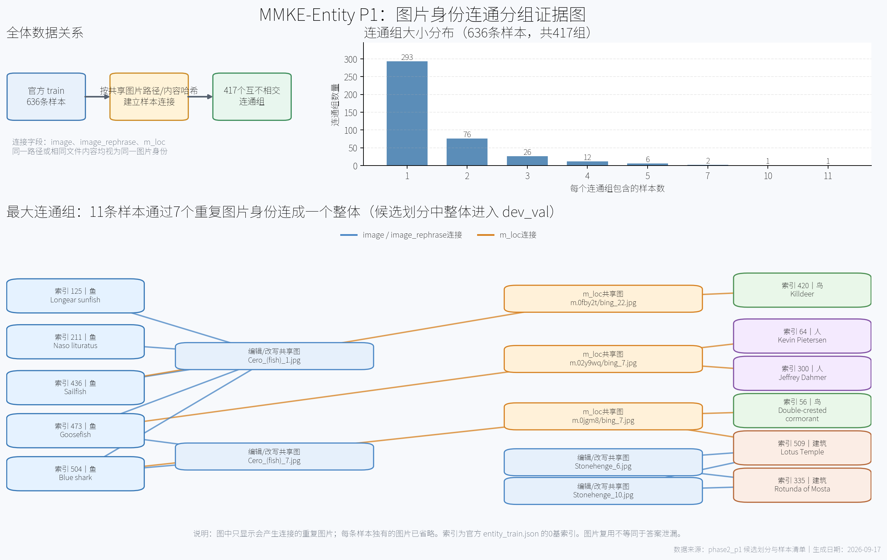

# 第二阶段 P0/P1 核验记录：重要路径、配置与当前门槛

更新时间：2026-09-21（Asia/Shanghai；文件名日期保留以兼容既有引用）。

本文汇总第二阶段 P0、P1 实际核验以及服务器 locality 修复的关键结论。它是实验交接与路径索引，不替代原始 JSON、源码、运行日志和结构化证据。发生冲突时，以服务器实时文件及其 SHA-256 为准；本地 `phase2_p0`、`phase2_p1` 是服务器证据和报告的镜像，不能用本地不完整数据推断服务器状态。

## 1. 当前结论

| 项目 | 当前状态 | 结论边界 |
|---|---|---|
| P0 静态证据核验 | 完成 | 配置、runner、Adapter、hook、训练协议和历史产物已核验 |
| P0 本轮单样本前向 | **未执行** | 2026-09-11 有历史探测记录，但不能替代本轮重验 |
| Ours 目标层 | 已确认 | 正式主公式 Top-1=L0，Top-3=L0/L1/L2；有效定位请求284/636 |
| Adapter hook | 已确认 | `post-block forward hook`，直接修改视觉token范围 `[0,32)` |
| P1 字段与数据结构 | 完成 | 官方数据、第一阶段兼容数据、Portability和图片结构已全量审计 |
| locality 图片准备 | **已修复并验证** | 1837张原图已发布到`MMKE-Bench/data_image/locality`；没有覆盖历史输入 |
| 新 dev 划分 | **已通过；最终509/127** | 416个主体/事实/图片连通分量，最大11条；四类身份跨集合重叠均为0 |
| P2 | **核心1-hop保守版通过** | 636图机器检查0失败、修正后人工结构审核50/50；Overlay-2hop仍为扩展待办 |
| G1 | **不能启动** | P0本轮前向、新dev验收、协议冻结等条件仍未齐备 |

不能用一个笼统的 PASS 代替这些分项状态。

## 2. 本地与服务器根目录

### 2.1 本地

| 用途 | 路径 |
|---|---|
| 项目根目录 | `D:\开题\正式开题\Model Edit\bli2-reasonvqa` |
| dataset工作目录 | `D:\开题\正式开题\Model Edit\bli2-reasonvqa\dataset` |
| 第二阶段手册 | `D:\开题\正式开题\Model Edit\bli2-reasonvqa\dataset\md\TODO\Second_prashe\第二阶段实验手册_知识图谱增强视觉语言模型编辑_v2.1.md` |
| 第一阶段代码证据包 | `D:\开题\正式开题\Model Edit\bli2-reasonvqa\dataset\md\TODO\Second_prashe\第一阶段真实代码_BLIP2_MMKE-Entity` |
| P0结果 | `D:\开题\正式开题\Model Edit\bli2-reasonvqa\phase2_p0` |
| P1结果 | `D:\开题\正式开题\Model Edit\bli2-reasonvqa\phase2_p1` |

### 2.2 服务器

| 用途 | 路径 |
|---|---|
| 工程根目录 | `/datapool/home/ph_teacher3/Lwy/zhounan/Visedit2/VisEdit-main` |
| 正式共享结果根目录 | `/datapool/home/ph_teacher3/Lwy/zhounan/Visedit2/server_results` |
| 官方MMKE数据根目录 | `/datapool/home/ph_teacher3/Lwy/zhounan/Visedit2/datasets/MMKE-Bench` |
| 官方图片目录 | `/datapool/home/ph_teacher3/Lwy/zhounan/Visedit2/datasets/MMKE-Bench/data_image`；当前并列含`entity/locality/visual` |
| 原始图片ZIP | `/datapool/home/ph_teacher3/Lwy/zhounan/Visedit2/datasets/MMKE-Bench/hf_snapshot/data_image.zip` |
| P0服务器脚本/证据 | `/datapool/home/ph_teacher3/Lwy/zhounan/Visedit2/VisEdit-main/phase2_p0`（若服务器保留；正式本地交付以项目根 `phase2_p0` 为准） |
| P1服务器证据 | `/datapool/home/ph_teacher3/Lwy/zhounan/Visedit2/VisEdit-main/phase2_p1` |
| 计算节点临时目录 | `/tmp/ph_teacher3`，不能长期保存正式产物 |

SSH连接使用Windows系统OpenSSH：

```powershell
& "$env:WINDIR\System32\OpenSSH\ssh.exe" `
  -i "$HOME\.ssh\id_ed25519_bridge" `
  -o BatchMode=yes `
  -o ConnectTimeout=10 `
  bridge-server
```

`bridge-server`进入`login01`。计算节点、Job、GPU和进度必须每次用`squeue`、`scontrol`、`sstat`和节点进程重新核验，不得沿用本文的历史快照。

## 3. P0：编辑层证据链

正式定位主公式：

```text
abs(S_v_cos) * S_v_new_norm
```

服务器原始分数：

```text
/datapool/home/ph_teacher3/Lwy/zhounan/Visedit2/server_results/
ours_direct_7models_3datasets_g08_gpu0_20260626_131624/
mmke-entity/blip2-opt-2.7b/ours_direct_layer_scores.csv
```

SHA-256：`b6f741b9f13b2d3b82bd9efa685f078126a0267fc92a6918b3effa21c831dff7`。

| 排名 | 层 | 分数 | 实际模块路径 |
|---|---|---:|---|
| Top-1 | L0 | 0.05071359254856098 | `language_model.model.decoder.layers.0` |
| Top-2 | L1 | 0.023807711423021117 | `language_model.model.decoder.layers.1` |
| Top-3 | L2 | 0.017035812060378103 | `language_model.model.decoder.layers.2` |

有效定位请求为284/636。存在L1训练记录只证明训练过L1，不能据此把Ours Top-1写成L1。

层编号从0开始：

```text
layer_00 → runner数值0 → decoder.layers[0] → 第1个block
layer_01 → runner数值1 → decoder.layers[1] → 第2个block
```

YAML默认`edit_layers: [19]`、某次runner实际`layers="1"`、checkpoint模块键`decoder.layers.1`、Ours排名是四类不同证据，不能互相替代。

## 4. P0：真实hook与模型接口

| 项目 | 已确认值 |
|---|---|
| 模型 | BLIP2-OPT-2.7B（Transformers加载器，不是手册中的LAVIS示例） |
| decoder层数 | 32 |
| hidden size | 2560 |
| 视觉token范围 | `[0,32)` |
| L0完整模块路径 | `language_model.model.decoder.layers.0` |
| Adapter类 | `VisionEditAdaptor` |
| Adapter构造 | `VisionEditAdaptor(2560, 1024, 8, 32, True, 1024)` |
| Adapter注册 | `register_forward_hook` |
| 实际编辑位置 | block输出之后，即post-block |
| 修改范围 | 输出hidden的视觉token段；非视觉token保持原值 |

`Trace/TraceDict`用于读取输入或输出、缓存和中间层推理；它不是实际修改表征的Adapter hook。源码注释不能单独证明pre-hook编辑已实现。

P0本轮前向仍未执行。历史探测曾记录hidden=`[1,201,2560]`、logits=`[1,201,50304]`和视觉段变化，但只能标作历史动态证据。

## 5. 第一阶段实际训练协议

真实运行配置副本：

```text
dataset/md/TODO/Second_prashe/
第一阶段真实代码_BLIP2_MMKE-Entity/config/actual_run_config.json
```

服务器YAML：

```text
/datapool/home/ph_teacher3/Lwy/zhounan/Visedit2/VisEdit-main/
configs/vead/blip2-opt-2.7b.yaml
```

核心有效值：

| 项目 | 有效值 |
|---|---|
| optimizer | Adam |
| 学习率 | `1e-4` |
| betas / eps / weight decay | `(0.9,0.999)` / `1e-8` / `0` |
| 训练参数 | 只更新Adapter及InfluenceMapper；基础VLM冻结 |
| epoch预算 | 50 |
| batch size | 2 |
| train请求数 | 636 |
| step/epoch | 318 |
| 总step | 15900 |
| CLI基础seed | 20260601 |
| 有效seed规则 | `base_seed + layer`；L1=20260602 |
| L0历史有效seed | `null`，原始CLI/日志尚缺，不能猜填 |
| loss权重 | rel=1；两个gen各1；两个loc各1；IT三个分量各0.1 |
| EMA alpha | 0.1 |
| checkpoint选择 | 每epoch保存，从存在且有限的checkpoint选最小EMA |
| 保留 | `keep_top=1`，`keep_last=0` |

50 epoch是训练预算；选中epoch不是训练停止点：

| 层 | 完成预算 | selected epoch / step | EMA | 历史Average |
|---|---|---|---:|---:|
| L0 | 50 epoch / 15900 step | 24 / 7632 | 6.1242322191733995 | 65.856 |
| L1 | 50 epoch / 15900 step | 11 / 3498 | 5.9904003300769855 | 72.504 |

L0 selected checkpoint：

```text
/datapool/home/ph_teacher3/Lwy/zhounan/Visedit2/server_results/
mmke_entity_top3_union_train_eval_7models_20260616_155000/
blip2-opt-2.7b/layer_00/records/vead/blip2-opt-2.7b/
pilot500_blip2_visedit_L00-lr-1-t-1-v-1/checkpoints/
epoch-24-i-7632-ema_loss-6.1242
```

L1 selected checkpoint：

```text
/datapool/home/ph_teacher3/Lwy/zhounan/Visedit2/server_results/
tmp_archives_20260810/g09/mabscos_top3_completion_job3126082_20260801/
mmke-entity/blip2-opt-2.7b/layer_01/records/vead/blip2-opt-2.7b/
pilot500_blip2_visedit_L01-lr-1-t-1-v-1/checkpoints/
epoch-11-i-3498-ema_loss-5.9904
```

第一阶段五项指标为teacher-forced token accuracy及编辑前后argmax一致率，不是自由生成句子EM。第一阶段没有实现Portability指标，不能写成0分。

## 6. P1：官方数据与历史兼容数据

### 6.1 官方只读数据

| 划分 | 服务器路径 | 数量 | SHA-256 |
|---|---|---:|---|
| train | `/datapool/home/ph_teacher3/Lwy/zhounan/Visedit2/datasets/MMKE-Bench/data_json/entity_train.json` | 636 | `1c1ed7d25bbcfcf52ba315217970d33b09f36265e5742ef98567a04946b60edc` |
| eval | `/datapool/home/ph_teacher3/Lwy/zhounan/Visedit2/datasets/MMKE-Bench/data_json/entity_eval.json` | 955 | `b721501bb2bd33d3c6fc4c7cf8b9ef93fb96b83c06ca013f8bc686fc03f7b605` |

两份文件实际都是JSON数组；解析异常、完整记录重复和派生稳定ID重复均为0。官方记录没有`sample_id/id/case_id`、可靠主体实体ID或编辑事实根ID。

### 6.2 第一阶段历史兼容数据

| 划分 | 服务器路径 | 数量 | SHA-256 |
|---|---|---:|---|
| train | `/datapool/home/ph_teacher3/Lwy/zhounan/Visedit2/server_results/mmke_entity_top3_union_train_eval_7models_20260616_155000/data/vqa_mmke_entity_train_evqa_compat.json` | 636 | `8871706ce094f683418bd576954d231c6354e3dd53e7b8c2200f54e129df012d` |
| eval | `/datapool/home/ph_teacher3/Lwy/zhounan/Visedit2/server_results/mmke_entity_top3_union_train_eval_7models_20260616_155000/data/vqa_mmke_entity_eval_evqa_compat.json` | 954 | `18e17ad906a313b79c5c3e6c7af340bf8aa5bb8f415490ee95b320184579bf68` |

历史兼容脚本在原`locality/m.xxxx/文件名`不存在时，改用`entity/同名文件`。该basename fallback丢失目录身份；大量替代文件与ZIP原图字节不同。历史结果必须按真实的旧兼容输入解释，不能称为修复后原图协议结果。

官方eval 955与历史兼容eval 954的差异已定位：原始0基索引403（第404条）因当时图片路径缺失被过滤。它的原图`locality/m.03w1v2/yahoo_14.jpg`实际存在于服务器保存的ZIP。

## 7. 服务器locality修复、正式发布位置与新兼容配置

修复目录：

```text
/datapool/home/ph_teacher3/Lwy/zhounan/Visedit2/VisEdit-main/
phase2_p1/locality_repair_20260916
```

该目录保留首次提取、清单和修正版JSON。2026-09-17按用户要求，又将已校验的locality图片发布到MMKE-Bench标准图片根，使其与entity、visual并列。没有覆盖官方JSON、历史兼容JSON、运行配置或模型。

现在服务器文件管理器应显示：

```text
/datapool/home/ph_teacher3/Lwy/zhounan/Visedit2/datasets/MMKE-Bench/data_image/
├── entity/
├── locality/
└── visual/
```

正式locality位置：

```text
/datapool/home/ph_teacher3/Lwy/zhounan/Visedit2/datasets/MMKE-Bench/data_image/locality
```

修复结果：

- 从服务器已有ZIP提取并发布1837个locality文件，共427143789字节（约407.36 MiB）。
- 保留`locality/m.xxxx/文件名`完整路径。
- 所有文件通过ZIP流读取CRC、SHA-256落盘与发布后复核，并通过Pillow格式验证和完整解码。
- 修正版train/eval为636/955，三类图片引用缺失数均为0。
- eval原索引403已经恢复。
- 正式发布前写入`.locality_p1_incomplete`，逐文件核对完成后才原子改名；最终临时目录不存在。
- 发布后再次全量核验，1837/1837文件与提取清单SHA-256一致。
- 官方源JSON和旧636/954兼容数据哈希保持不变；没有启动或停止训练。

必须整体使用以下配置：

```json
{
  "train_data": "/datapool/home/ph_teacher3/Lwy/zhounan/Visedit2/VisEdit-main/phase2_p1/locality_repair_20260916/data/vqa_mmke_entity_train_original_locality_compat.json",
  "eval_data": "/datapool/home/ph_teacher3/Lwy/zhounan/Visedit2/VisEdit-main/phase2_p1/locality_repair_20260916/data/vqa_mmke_entity_eval_original_locality_compat.json",
  "train_img_root": "/datapool/home/ph_teacher3/Lwy/zhounan/Visedit2/datasets/MMKE-Bench/data_image",
  "eval_img_root": "/datapool/home/ph_teacher3/Lwy/zhounan/Visedit2/datasets/MMKE-Bench/data_image",
  "train_samples": 636,
  "eval_samples": 955,
  "status": "MMKE_ROOT_LOCALITY_VERIFIED_NOT_TRAINING_AUTHORIZATION"
}
```

修正版文件哈希：

| 文件 | SHA-256 |
|---|---|
| train修正版JSON | `56db6bbdcc25d407a70d04a4172b525f5d1ee9f96350daaaf292874de19eeb65` |
| eval修正版JSON | `13083663c5322726f96607b6f94d4a97b304d3516cef0db020f19a6f6fce0f5b` |

当前推荐配置文件为：

```text
/datapool/home/ph_teacher3/Lwy/zhounan/Visedit2/VisEdit-main/phase2_p1/
locality_repair_20260916/repaired_data_config_mmke_root.json
```

只补`locality`目录或只换图片根、继续读取旧JSON，仍会沿用旧`entity/basename`路径。修正版JSON与当前MMKE图片根必须成套使用。

## 8. 字段用途与Portability

真实第一阶段加载映射：

| 原字段 | 真实用途 |
|---|---|
| `src` | request prompt |
| `alt` | 完整`target_new`；两类generality也以完整alt为target |
| `pred` | MMKE官方语义为编辑前旧知识描述；官方KE loader用它构造`pred >> alt || src`。第一阶段EVQA训练和正式评测不读取；逐记录生成模型/提示词/人工修订轨迹未公开 |
| `rephrase` | 文本泛化prompt |
| `image_rephrase` | 图像泛化图片 |
| `loc/loc_ans` | 文本locality prompt/target |
| `m_loc/m_loc_q/m_loc_a` | 图像locality image/prompt/target |
| `port_new` | 官方评测字段；第一阶段兼容转换丢弃，第一阶段五指标未使用 |
| `model_pred` | 不在官方JSON；来自Ours定位模型生成缓存，不是`pred`别名 |

官方train 636/636、eval 955/955均有有效`port_new`；每条实际列表长度为1，结构为：

```json
{
  "port_type": "1-hop",
  "Q&A": {
    "Question": "...",
    "Answer": "..."
  }
}
```

显式标签均为`1-hop`；结合MMKE论文的Portability生成方法和官方loader按`port_type`筛选的实现，本项目按官方定义记为**1-hop**。数据集没有提供显式中间推理链，这不是P1结构异常，也不影响Portability可用结论。Portability问答不得用于训练、分组、实体链接或子图构建；未来只能通过稳定sample_id在评测侧恢复，不能依赖删行后的行号。

## 9. 新dev候选及泄漏核验边界

> 2026-09-21状态替代：本节记录的508/128是早期图片身份候选。P2身份冻结后，正式划分为509/127，见`phase2_p1/final_split_20260921/`和本文“12. P2冻结后P1最终划分”。

固定seed=42，只从official train生成；没有利用official eval选择seed或比例。

| 项目 | 值 |
|---|---|
| official train | 636 |
| 连通组 | 417 |
| 最大组 | 11 |
| 候选dev_train | 508 |
| 候选dev_val | 128 |
| 实际比例 | 79.8742% / 20.1258% |
| 图片路径/内容哈希跨候选集合重叠 | 0 |
| 事实根重叠 | `null`，身份未识别 |
| 主体实体重叠 | `null`，身份未识别 |
| 验收状态 | `CANDIDATE_NOT_ACCEPTED` |

关系图如下。上半部分给出636条样本到417个连通组的整体分布；下半部分展开最大11条连通组，蓝线表示`image/image_rephrase`复用，橙线表示`m_loc`复用。图中只显示实际产生样本连接的重复图片。



可缩放矢量版本：[`p1_图片连通组关系图_20260917.svg`](p1_图片连通组关系图_20260917.svg)。生成脚本：`phase2_p1/render_image_connectivity_figure.py`。

候选文件名是`dev_train.candidate.json`和`dev_val.candidate.json`，每条均标记`CANDIDATE_NOT_ACCEPTED_DO_NOT_TRAIN`。没有生成已验收的`dev_train.json`、`dev_val.json`或`split_manifest.json`。

对`candidate_split_manifest.json`重新逐组验算：417个图片连通分量覆盖全部636条样本，跨`dev_train/dev_val`被拆开的连通分量为0。因此508/128已经**按当前图片身份连通分量完整划分完毕**。`CANDIDATE_NOT_ACCEPTED`来自另一层约束：官方MMKE自由文本记录没有可靠主体QID和事实根ID，所以目前只证明图片身份互斥，尚未证明主体/事实互斥。

官方train/eval存在图片复用，但这不能自动证明作者数据划分不合理或发生答案泄漏。作者官方4:6协议没有承诺所有主体、事实和图片完全互斥；本项目的新dev约束更严格，应与官方协议分开描述。

## 10. 严格复现与第二阶段新实验

### A. 第一阶段历史协议复现

必须保留：

- 历史兼容train636/eval954；
- 历史basename fallback图片行为；
- 原prompt、标签mask、五项指标和优化协议；
- 50 epoch、batch2、分层有效seed、最小EMA选点；
- 每层对应自身checkpoint和指标。

使用locality修正版955条eval后，不再是第一阶段严格输入复现。

### B. 第二阶段新dev实验

应使用原始locality路径及新修复图片根，补齐主体/事实身份后重新完成连通分组和dev验收。重新训练的G1属于第二阶段同划分基线，不能称为第一阶段严格复现。

## 11. 关键证据文件索引

### 11.1 P0

- [P0证据报告](../../../../phase2_p0/p0_evidence_report.md)
- [P0有效配置](../../../../phase2_p0/p0_effective_config.json)
- [手册冲突记录](../../../../phase2_p0/p0_manual_conflicts.md)
- [定位排名复算](../../../../phase2_p0/ranking_recomputed.json)
- [checkpoint选点复算](../../../../phase2_p0/checkpoint_selection_recomputed.json)
- [服务器协议元数据](../../../../phase2_p0/server_protocol_metadata.json)
- [P0单样本探测脚本](../../../../phase2_p0/probe_single_sample.py)：脚本已准备，本轮未执行

### 11.2 P1

- [MMKE字段定义与GLAME适配核验](MMKE字段定义与GLAME适配核验_20260917.md)
- [P1数据审计](../../../../phase2_p1/p1_data_audit.md)
- [字段映射](../../../../phase2_p1/field_mapping.md)
- [Portability覆盖率](../../../../phase2_p1/portability_coverage.json)
- [样本manifest](../../../../phase2_p1/sample_manifest.jsonl)
- [泄漏与分组报告](../../../../phase2_p1/leakage_report.md)
- [候选划分manifest](../../../../phase2_p1/candidate_split_manifest.json)
- [官方与兼容数据澄清](../../../../phase2_p1/official_split_vs_local_conversion.md)
- [locality修复报告](../../../../phase2_p1/locality_repair_report.md)
- [修复后配置](../../../../phase2_p1/locality_repair_20260916/repaired_data_config.json)
- [发布到MMKE根后的推荐配置](../../../../phase2_p1/locality_repair_20260916/repaired_data_config_mmke_root.json)
- [修复发布复查](../../../../phase2_p1/locality_repair_20260916/published_verification.json)
- [MMKE图片根最终复查](../../../../phase2_p1/mmke_root_locality_final_verification.json)
- [服务器最终复查](../../../../phase2_p1/locality_repair_final_check.json)
- [P1交付说明](../../../../phase2_p1/README.md)

本地P1不复制407 MiB图片，只镜像报告、配置、修正版JSON和校验清单。真实图片实体在服务器修复目录。

## 12. 下一步门槛

以下是2026-09-17时的进入P2前清单，现已由2026-09-21冻结结果替代：

1. 为每个稳定sample_id建立可靠主体实体ID和编辑事实根ID登记，记录来源与置信依据；不能直接用alt第一句代替主体。
2. 加入事实/主体身份后重新连接分组，复核是否出现巨大连通组，并重新检查type_self覆盖。
3. 明确P2究竟使用官方完整train/eval、已验收dev，还是其他协议；不得混用。
4. 若P2需要Portability，只能从官方记录按稳定ID恢复完整列表，不得加入训练输入。

启动G1前还需：

1. 完成P0本轮真实单样本前向探测；
2. 冻结目标层、模型/依赖/权重身份、训练预算和checkpoint选点规则；
3. 完成新dev验收；
4. 明确选择“第一阶段严格复现”还是“第二阶段原图新协议”；
5. 再次核验实时Slurm、GPU、launcher锁和存储位置。

在上述条件满足前，不启动训练，不将图片修复成功解释为P2或G1整体通过。

## 12. P2冻结后P1最终划分（2026-09-21）

- 正式文件：`phase2_p1/dev_train.json`（509条）、`dev_val.json`（127条）、`split_manifest.json`。
- 完整冻结目录：`phase2_p1/final_split_20260921/`。
- 分组身份：冻结主体Q-ID、事实根ID、官方`image/image_rephrase/m_loc`路径及内容SHA-256。
- 结果：416个连通分量，最大11条；主体Q-ID、事实根ID、图片路径及图片内容哈希跨集合重叠均为0。
- 复现：seed 42、稳定排序、单次确定性分配，逆序输入复算相同；official eval未用于选seed、比例或分组。
- 源文件：official train SHA-256前后均为`1c1ed7d25bbcfcf52ba315217970d33b09f36265e5742ef98567a04946b60edc`。
- 限制：official eval主体和事实身份未为本次划分提取，不能声称train/eval在这两层面无重叠。
- 门槛：P1-B已经通过，但P0本轮单样本前向仍未完成，G1训练仍禁止启动。
