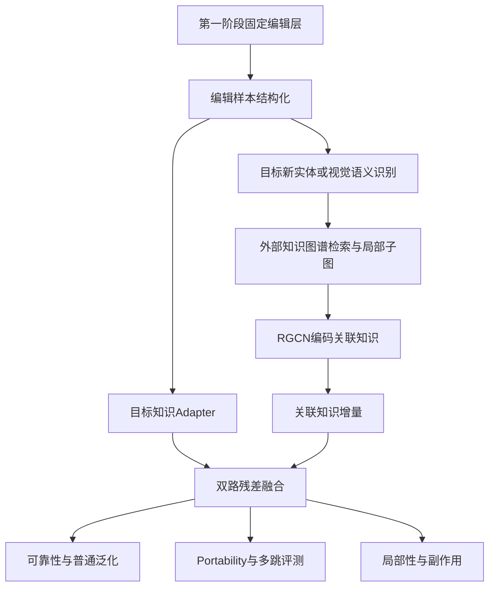

# 第二阶段：知识图谱增强视觉语言模型编辑总体与分项实验计划 v1.0

## 0. 阶段定位

### 0.1 与第一阶段的衔接

第一阶段解决“视觉编辑器应该插入语言解码器的哪一层”。当前正式定位方法已经确定为 Ours-Direct，主公式为：

$$
M_{\mathrm{abscos}\times\mathrm{newn}}(l)
=
\left|S_v^{\cos}(l)\right|\cdot S_v^{\mathrm{new\_norm}}(l).
$$

第二阶段不再重新研究候选层排序公式，而是将第一阶段确定的编辑位置作为固定输入，研究：在目标知识 Adapter 的基础上，引入由外部知识图谱编码得到的关联知识，能否提高编辑后模型对关联问题的泛化能力，同时保持目标编辑可靠性和无关知识局部性。

### 0.2 本阶段不是直接复现 GLAME

GLAME 面向纯文本 LLM，先围绕编辑后的新对象从外部知识图谱抽取局部子图，再用 RGCN 聚合相关知识，最后通过 ROME 式秩一更新修改 FFN 参数。

本研究只借鉴 GLAME 的两项核心思想：

1. Knowledge Graph Augmentation：围绕编辑目标构建编辑诱导的局部关联子图；
2. Graph-based Knowledge Edit：将图结构编码结果参与知识编辑。

不同之处是：本研究冻结视觉语言模型主体，不直接改写 FFN 权重，而是在 Ours-Direct 定位层通过视觉-only Adapter 修改视觉 token 表征，并融合目标知识增量和关联知识增量。

## 1. 总体研究目标与假设

### 1.1 总体目标

构建“定位—目标知识注入—关联知识注入—双路融合—关联泛化评测”的完整方法，验证结构化外部知识是否能使视觉编辑从单点答案修正扩展到关联知识应用。

### 1.2 主要研究假设

- H1：在同一编辑位置和训练预算下，相关知识图谱能够提高 MMKE 的 Portability；
- H2：RGCN编码的相关子图应优于无图 Adapter、平铺三元组和同规模随机图；
- H3：Portability提升不应以明显降低 Reliability、Generality或Locality为代价；
- H4：Ours定位层与知识图谱增强具有互补性，即在Ours层加入图谱仍能获得额外收益；
- H5：随着子图阶数增加，性能先改善后受噪声影响，不应默认图越大越好。

### 1.3 主结论判定原则

本阶段的主指标是 Portability，而不是继续以五项平均分作为唯一主指标。

完整方法只有同时满足以下条件，才能支持“知识图谱增强了关联泛化能力”：

1. Portability显著高于 Adapter-only；
2. 显著高于同规模随机图；
3. 不能完全被平铺三元组带来的额外文本解释；
4. Reliability与Locality下降不超过预注册非劣界；
5. 多随机种子的提升方向一致。

## 2. 总体技术路线



整体执行分为六个阶段：

1. 实验口径冻结与数据审计；
2. 外部知识图谱及评测数据准备；
3. 目标知识注入基线复现；
4. 关联知识编码与双路融合实现；
5. 小规模可行性验证；
6. 主实验、消融、跨模型扩展与统计分析。

## 3. 正式实验前必须修正的方案问题

### 3.1 编辑层选择不得使用第二阶段测试集

第二阶段对每个“模型×数据集”只允许使用以下两种层选择方式之一：

- 方式A：直接使用 Ours-Direct 预测 Top-1，完全不看真实训练结果；
- 方式B：在 Ours Top-3 内使用独立 validation 选择最佳层。

如果第一阶段某层的真实性能来自最终 eval/test，则不能再次用这些测试结果为第二阶段选层。此时优先使用 Ours预测Top-1；或者从训练集划出validation重新选择。层一旦确定，所有有图/无图实验组必须共享同一层。

### 3.2 修正双路融合中原始视觉表征重复相加的问题

当前方案分别写为：

$$
\ddot H_v=H_v+\Delta H_{target},
\qquad
\dddot H_v=H_v+\Delta H_{KG},
$$

若再使用 $\underline H_v=\ddot H_v+\dddot H_v$，将得到：

$$
\underline H_v=2H_v+\Delta H_{target}+\Delta H_{KG},
$$

会无意中把原始视觉表征放大两倍。正式实现必须将两个模块定义为增量，使用：

$$
H_v'=H_v+\Delta H_{target}+\beta\Delta H_{KG}.
$$

或者等价地使用：

$$
H_v'=\ddot H_v+\dddot H_v-H_v.
$$

推荐第一种写法，模块含义最清楚。

### 3.3 关联知识不能无投影地广播到所有视觉token

当前 $H_v+z_{o^*}^{n}$ 的写法存在三个问题：维度可能不一致、所有视觉token获得相同增量、图谱噪声无法抑制。

正式版本改为：

$$
\Delta H_{KG}
=
C_{KG}(H_v,q,z_G)\odot W_G z_G,
$$

其中 $W_G$ 将图向量投影至视觉隐藏维度，$C_{KG}\in[0,1]^{N_v\times1}$ 是问题条件化的视觉token门控，$\beta$ 控制整体图谱剂量。

### 3.4 统一术语为RGCN

如果不同关系类型具有独立或基分解参数，应统一称为 Relational Graph Convolutional Network，缩写 RGCN；`g(·)` 是ReLU等激活函数，$W_1/W_2$ 是可训练矩阵，不能把 $W_1$ 写成ReLU函数。

## 4. 数据集总体安排

| 数据集 | 第二阶段角色 | 现有Portability | 图谱形式 | 能支持的结论 |
|---|---|---|---|---|
| MMKE-Entity | 第一主数据集 | 有，`port_new` | Wikidata/MMpedia实体关系子图 | 一跳关联实体知识迁移 |
| MMKE-Visual | 第二主数据集 | 有，`one_hop_img + port_new` | 受约束视觉语义图 | 编辑视觉语义向新图像场景迁移 |
| E-VQA | 通用编辑与副作用对照 | 无 | 可解析样本级场景关系，但无关联评测 | 可靠性、改写泛化、局部性 |
| KGPort-Edit扩展集 | 多跳主评测扩展 | 需要新建 | 带QID/PID/route的1–3跳图 | 编辑知识沿明确路径传播 |
| ReasonVQA | 路径数据和构建流程参考 | 有1–3跳QA，但无编辑请求 | Wikidata路径+场景图 | 不能未经改造直接作为编辑后评测集 |

### 4.1 数据使用隔离

构图可使用：训练split中的 `src`、`pred/model_pred`、`alt`、`image` 和独立外部知识源。

正式测试时禁止构图模块读取：

- `port_new.Question/Answer`；
- `rel/m_rel`及答案；
- `rephrase`与泛化答案；
- eval/test中的`loc/m_loc`；
- ReasonVQA式gold route。

训练split的locality样本可以按既有Adapter协议用于KL保持约束，但eval/test locality样本只能评测。`port_new`在任何split都不得作为图谱筛选或训练监督。

## 5. 总体实验矩阵

### 5.1 核心对照组

| 组别 | 目标知识Adapter | 关联信息 | 图编码 | 目的 |
|---|---:|---|---:|---|
| G0 Base VLM | 否 | 无 | 否 | 原模型下界 |
| G1 Adapter-only | 是 | 无 | 否 | 目标知识编辑基线 |
| G2 Adapter+FlatTriples | 是 | 相关三元组序列 | 否 | 控制外部文本信息量 |
| G3 Adapter+RGCN | 是 | 相关局部子图 | 是 | 完整图结构编码 |
| G4 Adapter+RandomGraph | 是 | 同规模无关子图 | 是 | 控制参数量和图规模 |
| G5 Adapter+RGCN w/o IM | 是 | 相关局部子图 | 是 | 检验Influence Mapper作用 |

### 5.2 定位与图谱的2×2分解

在完整方法稳定后，对代表性组合增加：

| 编辑位置 | 无图谱 | 有图谱 |
|---|---|---|
| Middle-Prior或最强基线层 | A | B |
| Ours定位层 | C | D |

解释：

- $C-A$：Ours定位带来的收益；
- $B-A$：基线层上的图谱收益；
- $D-C$：Ours层上的图谱额外收益；
- $(D-C)-(B-A)$：定位与图谱是否存在交互作用。

## 6. 分项计划P0：第一阶段接口冻结

### 目标

为每个第二阶段实验组合确定唯一合法的Adapter插入层和一致的hook语义。

### 任务

1. 导出各模型各数据集的 Ours Top-1/Top-3；
2. 明确层编号表示“Adapter直接插入层”，不做Pre前移；
3. 统一hook位于decoder block输入、attention后还是block输出；
4. 保存视觉token span和attention mask；
5. 确定采用Top-1还是Top-3 validation选择规则；
6. 冻结配置，不再根据KG实验结果换层。

### 输出

- `stage2_layer_registry.json`；
- `stage2_layer_registry.md`；
- 每个模型一条hook单元测试。

### 验收

- 有图和无图组的原始层输入完全一致；
- 关闭Adapter和图模块时输出与基础模型一致；
- 每个组合只有一个正式编辑层。

## 7. 分项计划P1：Portability与数据覆盖审计

### 目标

确认MMKE现有Portability数据是否足以支撑首轮实验，并明确E-VQA的使用边界。

### 任务

1. 统计MMKE-Entity和MMKE-Visual中`port_new`非空率、可解析率和`port_type`分布；
2. 检查MMKE-Visual的`one_hop_img`文件是否存在；
3. 检查问题、答案、图像路径和样本ID是否一一对应；
4. 统计Port答案长度、实体类型和问题模板；
5. 标记`no_port`、`invalid_port`和`missing_image`；
6. 对E-VQA确认无Portability字段，只保留五项原指标。

### 输出

- `portability_coverage.csv`；
- `portability_schema_report.md`；
- `invalid_port_records.jsonl`。

### 验收

- 正式主表同时报告Port有效子集结果和全数据覆盖率；
- 不静默删除无Port样本；
- `port_new`未进入定位或图构建输入。

## 8. 分项计划P2：MMKE-Entity外部子图构建

### 目标

参考GLAME，为每条实体编辑样本构建独立、可追溯的编辑诱导局部子图。

### 输入结构化

从 `pred/model_pred` 与 `alt` 的差异中抽取：

$$
e_i=(s_i,r_i,o_i,o_i^*),
$$

其中$s_i$为视觉主体，$r_i$为被编辑关系，$o_i$为旧对象，$o_i^*$为目标新对象。

### 任务

1. 使用规则+冻结抽取器识别$(s,r,o,o^*)$；
2. 对$s$和$o^*$执行Wikidata实体链接，保存Top-5候选；
3. 使用SPARQL查询$o^*$的一跳邻居；
4. 通过关系白名单、来源可靠性、重复性和度数限制过滤；
5. 首轮设置$n=1,m\leq10$；
6. 缓存所有查询并记录Wikidata快照日期；
7. 对低置信链接标记`unlinked`，不能自动猜测；
8. 人工复核随机50条和全部低置信样本。

### 子图格式

每条边必须保存：`head_qid`、`property_id`、`tail_qid/value`、标签、hop、来源、查询日期和置信度。

### 输出

- `entity_linking.jsonl`；
- `subgraphs/mmke_entity/{split}/{edit_id}.json`；
- `graph_coverage_report.md`；
- `relation_whitelist.yaml`。

### 验收

- 实体链接覆盖率≥80%；
- 人工链接准确率≥90%；
- 正式边100%可追溯；
- 不读取`port_new`选择关系；
- 失败样本保留失败原因。

## 9. 分项计划P3：MMKE-Visual受约束语义图

### 目标

解决动作、手势、纹理和关系等概念难以唯一链接Wikidata的问题。

### 图模式

预先固定节点类型：`visual_concept`、`actor`、`object`、`scene`、`meaning`、`rule`、`result`、`attribute`。

预先固定关系：`has_meaning`、`performed_by`、`acts_on`、`occurs_in`、`causes`、`requires`、`has_attribute`、`related_to`。

### 任务

1. 按`type_self`选择固定schema；
2. 从`src+alt+image`抽取目标概念；
3. 优先链接可链接的外部实体；
4. 对不可链接概念使用冻结离线语义库；
5. 每条样本至少包含目标节点和两条经验证关联边；
6. 不能使用`port_new`、`rel`或`m_rel`反向生成图；
7. 人工审核全部试点样本，正式扩展后分层抽查。

### 输出

- `visual_semantic_schema.yaml`；
- `subgraphs/mmke_visual/...`；
- `insufficient_graph.jsonl`；
- `semantic_graph_review.csv`。

### 验收

- 所有关系均属于预注册schema；
- 无证据边比例为0；
- 合格子图覆盖率≥70%；
- 单独报告不同视觉语义类型的覆盖率。

## 10. 分项计划P4：编辑对齐的多跳评测集KGPort-Edit

### 目标

补足MMKE只有一跳Portability、缺少QID/PID/route的问题，构建能明确评价1–3跳传播的编辑后评测集。

### 原则

ReasonVQA原始问题具有`hop/entity_id/property_id/route`注释，但没有与当前模型编辑一一对应的$(s,r,o\rightarrow o^*)$请求，因此不能直接把ReasonVQA准确率当作编辑后泛化性。

需要仿照ReasonVQA的数据结构，围绕MMKE-Entity编辑后的$o^*$生成编辑对齐问题。

### 构建流程

1. 选择已正确链接$o^*$的MMKE-Entity样本；
2. 从$o^*$出发采样1、2、3条外部关系路径；
3. 问题必须同时依赖编辑边$(s,r,o^*)$和至少一条外部边；
4. 保存`root_qid`、`property_ids`、`route`、`hop`、问题和答案；
5. 自动排除不依赖编辑也能回答的问题；
6. 检查答案唯一性、时间敏感性、别名和多值属性；
7. 小规模数据全部人工验证。

### 规模

- Pilot：每跳30条，共90条；
- Formal-small：每跳100条，共300条；
- 若3-hop有效样本不足，宁可报告实际覆盖，不用低质量问题凑数。

### 输出

- `kgport_edit_1hop.jsonl`；
- `kgport_edit_2hop.jsonl`；
- `kgport_edit_3hop.jsonl`；
- `kgport_human_review.csv`；
- `kgport_generation_report.md`。

### 验收

- 每条问题均有唯一可验证答案；
- 每条问题均保存完整gold route；
- 问题确实依赖编辑后的$o^*$；
- 评测问题不参与训练与子图筛选。

## 11. 分项计划P5：目标知识Adapter基线复现

### 目标

在固定编辑层上复现第一阶段Adapter-only性能，建立第二阶段公平基线。

### 任务

1. 冻结视觉编码器和语言模型；
2. 只启用目标知识Adapter和Influence Mapper；
3. 使用完整`alt`序列的长度归一化teacher-forcing损失；
4. 保持第一阶段优化器、epoch、batch size、早停与checkpoint规则；
5. 重新输出逐样本Rel、Gen、Loc和Port；
6. 验证结果与第一阶段同层结果处于允许误差范围。

### 验收

- 同一seed下核心指标与原结果差异≤0.5个百分点，或给出可复现原因；
- selected checkpoint非空；
- 关闭图模块不会改变基线参数量与前向路径。

## 12. 分项计划P6：RGCN编码与图知识注入

### 12.1 子图初始化

将实体和关系文本分别输入冻结文本解码器，在固定早层$k_{init}$提取末token隐藏状态：

$$
z_e^0=h_{[e]}^{k_{init}}(e),
\qquad
z_r=h_{[r]}^{k_{init}}(r).
$$

试点阶段使用固定相对早层，例如$k_{init}=\lfloor0.2L\rfloor$；只能在validation上调整。

### 12.2 RGCN编码

$$
z_v^{t+1}
=
\sigma\left(
W_0^{t}z_v^t
+
\sum_{r\in\mathcal R}
\sum_{u\in\mathcal N_r(v)}
\frac{1}{c_{v,r}}W_r^tz_u^t
\right).
$$

首轮$n=1$，得到根节点图向量$z_G$。关系数过多时使用basis decomposition，避免参数随关系类型爆炸。

### 12.3 关联知识注入

$$
\Delta H_{KG}
=
C_{KG}(H_v,q,z_G)\odot \mathrm{Norm}(W_Gz_G).
$$

`Norm`使用LayerNorm或RMSNorm；门控初始化为接近0，使模型从Adapter-only平滑开始训练。

### 输出与调试

- 图节点/边batch张量；
- 根节点向量和图向量；
- 每层梯度范数；
- 门控均值、方差和饱和比例；
- $\|\Delta H_{target}\|/\|H_v\|$ 与 $\|\Delta H_{KG}\|/\|H_v\|$。

### 验收

- 10条样本可稳定过拟合；
- RGCN、投影层和门控均有非零有限梯度；
- 关闭图门控时严格退化为Adapter-only；
- 不出现NaN、全0门控或全1门控。

## 13. 分项计划P7：双路融合与训练目标

### 正式前向

$$
H_v'=H_v+\Delta H_{target}+\beta\Delta H_{KG}.
$$

### 损失函数

建议使用：

$$
\mathcal L
=
\mathcal L_{edit}
+\lambda_{loc}\mathcal L_{loc}
+\lambda_{gate}\mathcal L_{gate}
+\lambda_{norm}\mathcal L_{norm}.
$$

其中：

- $\mathcal L_{edit}$：目标`alt`完整序列的长度归一化负对数似然；
- $\mathcal L_{loc}$：训练split无关样本上编辑前后分布的KL约束；
- $\mathcal L_{gate}$：门控稀疏或熵约束，避免全图广播；
- $\mathcal L_{norm}$：限制两路残差相对原视觉表征的幅度。

不得直接使用正式`port_new`训练RGCN，否则无法检验模型是否产生了关联泛化。

### 超参数原则

- 首轮只搜索$\beta$和$\lambda_{loc}$；
- 搜索范围和选择规则提前写入配置；
- 所有超参数仅用validation选择；
- 主结果确定后不根据test结果调整。

## 14. 分项计划P8：最小可行性试验

### 14.1 试点对象

- 数据集：MMKE-Entity；
- 模型：BLIP2-OPT-2.7B；
- 编辑层：若有独立validation，则在Ours候选`L0/L1/L2`内选定；没有独立validation时直接固定Ours Top-1 `L0`；
- 开发样本：先10条过拟合，再100条小规模训练；
- 正式试点：使用完整训练split，最终在独立eval上评测；
- 实验组：G0–G4；
- 随机种子：开发1个，正式试点3个。

### 14.2 试点主指标

$$
\Delta Port
=
Port_{G3}-Port_{G1}.
$$

同时计算：

$$
Gap_{random}=Port_{G3}-Port_{G4},
$$

$$
Gain_{structure}=Port_{G3}-Port_{G2}.
$$

### 14.3 放行标准

- $\Delta Port\ge3$个绝对百分点；
- G3优于G4；
- 三个seed提升方向一致；
- Reliability、T-Loc、M-Loc相对G1下降均不超过2个百分点；
- G3不能只在少数已泄漏或异常样本上提升。

未通过时的处理：

- G3≈G2：图编码没有额外价值，先检查RGCN与关系建模；
- G3≈G4：相关性筛选或实体链接失败；
- Port提高但Locality明显下降：降低$\beta$、加强门控或KL约束；
- 所有组Port均低：先审计`port_new`任务难度和基础模型可回答性。

## 15. 分项计划P9：MMKE-Visual语义迁移试验

在MMKE-Entity试点通过后执行。

### 配置

- 模型仍先使用BLIP2；
- 实验组G1–G5；
- 主指标为`one_hop_img + port_new`上的视觉Portability；
- 按`type_self`分层报告动作、手势、属性、关系、布局等结果；
- 同时报告合格语义图子集与全体样本覆盖率。

### 关键判断

MMKE-Visual的Portability主要检验编辑视觉语义能否用于新组合图像，不等价于Wikidata多跳事实推理。因此该实验支持“视觉语义迁移”，而多跳知识传播结论必须来自KGPort-Edit。

## 16. 分项计划P10：跨模型与跨架构扩展

### 第一扩展批次

优先选择当前第一阶段结果完整的模型：

1. BLIP2-OPT-2.7B：Q-Former架构，主试点；
2. Qwen2.5-VL-3B：原生多模态架构；
3. SmolVLM-Instruct-1.7B：轻量模型。

先在MMKE-Entity复现G1、G3、G4；结果稳定后再加入MMKE-Visual和全部消融。

### 第二扩展批次

在第一阶段缺层补齐后加入LLaVA、MiniGPT-4等模型。PaliGemma需避免只在接近天花板的组合上得出结论，并继续区分主配置与stable配置。

### 资源控制

第二阶段不建议一开始就运行7模型×3数据集×6组×3seed。推荐顺序：

1. 1模型×1数据集×5组；
2. 1模型×2数据集；
3. 3模型×2数据集；
4. 方法稳定后再决定是否扩展到7模型。

## 17. 分项计划P11：消融与敏感性实验

### 17.1 必做消融

- 无图Adapter；
- FlatTriples；
- RandomGraph；
- 去掉Influence Mapper；
- 去掉关系类型，RGCN改GCN；
- $n=0$，仅目标节点；
- 只注入图谱，不注入目标知识；
- 双路融合改为简单相加。

### 17.2 子图敏感性

- 图阶数$n\in\{0,1,2,3\}$；
- 最大邻居数$m\in\{5,10,20\}$；
- 图谱系数$\beta\in\{0.1,0.3,0.5,1.0\}$；
- 初始化层相对深度$k_{init}/L\in\{0,0.1,0.2,0.3\}$；
- 实体链接置信阈值；
- 关系白名单与全关系。

所有敏感性选择在validation完成。GLAME观察到2-hop可能最佳、过高阶数引入噪声；本研究需要重新验证，不能直接继承其最优值。

## 18. 分项计划P12：评价指标与统计分析

### 18.1 原有五项指标

- Reliability；
- Text Generality；
- Multimodal/Image Generality；
- Text Locality；
- Multimodal/Image Locality。

### 18.2 新增图谱指标

- Port@1；
- KGPort@2；
- KGPort@3；
- 按hop分层准确率；
- Gold-route Recall：检索子图覆盖正确路径的比例；
- Entity Linking Accuracy；
- Valid Graph Coverage；
- Relevant-vs-Random Gap；
- Graph-structure Gain；
- 新增参数量、训练时间、推理时间和峰值显存。

### 18.3 统计方法

- 所有方法在相同样本上配对比较；
- QA正确性使用McNemar检验；
- 指标差使用配对bootstrap 95%置信区间；
- 三随机种子报告均值±标准差；
- 多个基线比较使用Holm校正；
- 报告胜/平/负样本数；
- 对无图覆盖样本同时做intent-to-treat式全样本统计，避免只报告容易链接的子集。

## 19. 分项计划P13：失败分析与可视化记录

每条错误至少归入以下一类：

- 目标实体抽取错误；
- Wikidata实体消歧错误；
- 正确实体但缺少关系；
- 子图包含正确路径但RGCN未利用；
- 图谱噪声压过视觉证据；
- 目标知识编辑失败；
- 关联知识正确但视觉指代失败；
- 图增强造成无关知识漂移；
- 时效性或多值答案问题。

保存可视化所需数据：层号、视觉token门控热图、目标知识门控、图谱节点/边权重、gold route、预测答案和错误类别。可视分析界面放在方法与评测稳定后开发，不应先于核心实验。

## 20. 推荐总体执行顺序

| 顺序 | 小计划 | 预计产物 | 是否阻塞下一步 |
|---:|---|---|---|
| 1 | P0层与hook冻结 | 层注册表、hook测试 | 是 |
| 2 | P1 Portability审计 | 覆盖率和无效样本报告 | 是 |
| 3 | P2 MMKE-Entity子图 | 一跳实体子图 | 是 |
| 4 | P5 Adapter基线复现 | G1基线结果 | 是 |
| 5 | P6/P7图模块与融合 | 可训练完整模型 | 是 |
| 6 | P8最小可行性试验 | G0–G4对照结果 | 是 |
| 7 | P3 MMKE-Visual语义图 | 语义子图与覆盖率 | 否 |
| 8 | P4 KGPort-Edit | 1–3跳评测集 | 否 |
| 9 | P9视觉语义试验 | MMKE-Visual结果 | 否 |
| 10 | P10跨模型扩展 | 3模型结果 | 否 |
| 11 | P11/P12消融与统计 | 最终实验表 | 是 |
| 12 | P13失败分析与可视化 | 案例与交互数据 | 否 |

## 21. 建议八周排期

| 周次 | 工作重点 |
|---|---|
| 第1周 | P0层接口冻结、P1字段与Port覆盖审计 |
| 第2周 | MMKE-Entity结构化、实体链接和SPARQL缓存 |
| 第3周 | 子图过滤、人工审计、Adapter-only复现 |
| 第4周 | RGCN、图投影、门控和双路融合实现 |
| 第5周 | 10样本过拟合与100样本试跑，修正工程问题 |
| 第6周 | BLIP2×MMKE-Entity正式小规模对照与3seed |
| 第7周 | MMKE-Visual语义图、KGPort-Edit pilot |
| 第8周 | Qwen/SmolVLM扩展、消融、统计和阶段报告 |

若P8未达到放行标准，第7–8周不扩展模型，优先解决图谱相关性和融合机制。

## 22. 最终目录结构

```text
stage2_kg_edit/
├── configs/
│   ├── layer_registry.json
│   ├── data_split.yaml
│   ├── relation_whitelist.yaml
│   ├── graph_config.yaml
│   └── experiment_groups.yaml
├── data_normalized/
├── entity_linking/
├── subgraphs/{mmke_entity,mmke_visual}/
├── kgport_edit/
├── audits/
├── checkpoints/{model}/{dataset}/{group}/{seed}/
├── predictions/{model}/{dataset}/{group}/{seed}/
├── results/
│   ├── metrics.csv
│   ├── per_sample.jsonl
│   ├── significance.csv
│   └── resource_cost.csv
└── reports/
    ├── pilot_report.md
    ├── ablation_report.md
    └── stage2_final_report.md
```

## 23. Codex启动任务清单

Codex首次执行时只做以下任务，不立即启动全量训练：

1. 读取三个数据集train/eval字段；
2. 生成Portability覆盖审计；
3. 建立评价字段隔离测试；
4. 输出各模型第二阶段层注册表；
5. 选取100条MMKE-Entity构图；
6. 输出实体链接和图边人工复核表；
7. 完成10条样本的Adapter+RGCN过拟合测试；
8. 所有验收通过后，再生成正式G0–G4运行脚本。

## 24. 阶段结束应形成的论文证据

本阶段至少应形成：

1. 完整方法相对Adapter-only的Portability提升；
2. 相关图优于随机图的因果对照；
3. RGCN相对FlatTriples的结构收益；
4. 可靠性和局部性的非劣结果；
5. 1–3跳性能随hop变化的曲线；
6. 不同图阶数和邻居数的敏感性；
7. 定位与图谱2×2贡献分解；
8. 典型成功与失败案例；
9. 参数量、时间和显存开销；
10. 可追溯的实体链接与gold route证据。

## 25. 可用于论文的阶段描述

> 在第一阶段确定视觉编辑Adapter的候选插入层后，第二阶段固定编辑位置并引入知识图谱增强机制。受GLAME启发，本文首先围绕编辑后的目标实体或视觉语义构建样本级局部关联子图，并利用RGCN聚合实体与关系信息。随后，目标知识注入模块根据编辑提示生成问题相关的视觉表征增量，关联知识注入模块将子图表示投影并门控注入同一层视觉token。两路增量以残差方式与原始视觉表征融合，并继续传递至后续冻结解码层。实验通过Adapter-only、平铺三元组、相关子图和随机子图等对照，评价结构化外部知识对编辑可靠性、普通泛化、关联知识Portability及局部性的影响。

## 26. 参考依据

1. Zhang et al. Knowledge Graph Enhanced Large Language Model Editing. EMNLP 2024. https://aclanthology.org/2024.emnlp-main.1261/
2. GLAME official repository. https://github.com/Acruxos/GLAME
3. Du et al. MMKE-Bench: A Multimodal Editing Benchmark for Diverse Visual Knowledge. ICLR 2025. https://arxiv.org/abs/2502.19870
4. Tran et al. ReasonVQA: A Multi-hop Reasoning Benchmark with Structural Knowledge for Visual Question Answering. ICCV 2025. https://arxiv.org/abs/2507.16403

