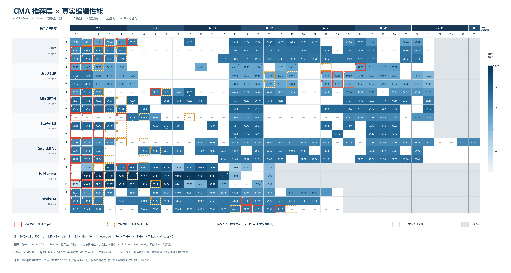
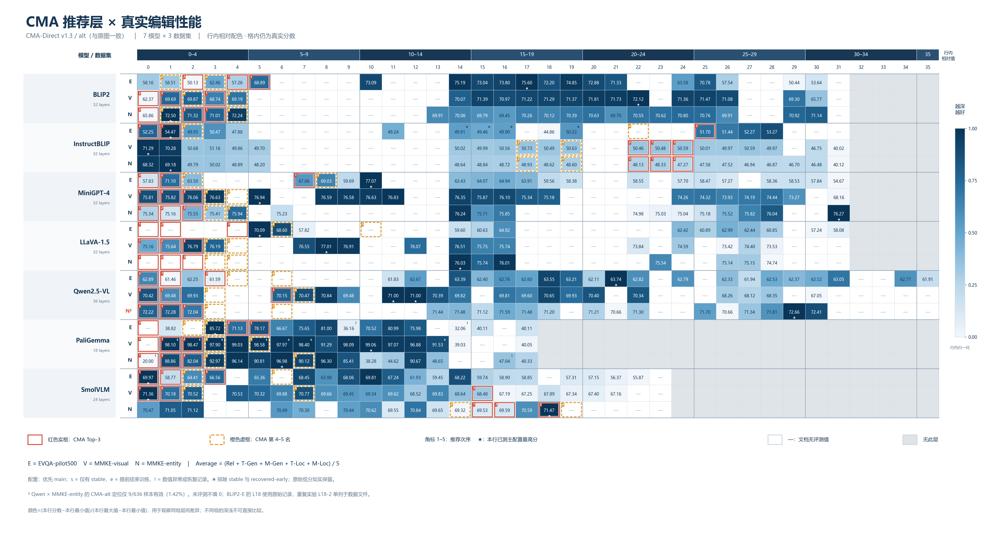

# CMA 候选层与真实编辑性能热力图

本次按用户截图使用 **CMA-Direct v1.3 / alt**。候选取自推荐文档第 3.7 节，未与 ModelPred v2 混合。

- 蓝色越深，真实 Average 越高；全图共享 0–100 分色标。格内显示两位小数，颜色使用原始精度。
- 红色实框为 Top-3，橙色虚框为第 4–5 名；角标数字为方法推荐次序。所有已有评测的层均着色，不限于 CMA 候选。
- 白格的横线表示指定文档没有评测分数；灰格表示模型没有此层。二者都不按 0 分处理。
- ★ 标出同一模型与数据集组合已测 main/main-legacy 中的最高值，只作为观察参照，不代表全层最优。
- 优先 main；没有 main 时保留 stable 并标 s。e 表示 recovered-early，! 表示源状态含数值异常、nonfinite 或 stall 恢复。各配置不混作公平比较。
- BLIP2-EVQA 的 L18 原始结果为 72.20；L18-2 为重复实验 73.34，保留在数据文件中，不通过取最大值覆盖原始层。
- Qwen2.5-VL × MMKE-entity 的历史 CMA 只有 9/636 个有效定位样本（1.42%），行标签以 † 提示。
- 共展示 377 个层的真实分数；Top-3 候选有 55/63 个具有评测值，Top-5 为 83/105（包含明确标记的 stable-only）。

## 同组层间差异放大版

此图保留所有真实数字，但颜色按每行已显示分数的最小/最大值归一化：同组越高越深，不同组的颜色不能直接比较。

## 可复核文件

- `cma_heatmap_data.json`：全部原始记录、每格使用的分数与配置、源文档行号、候选排名、源文件 SHA-256。
- 同名 PNG 为高清图，SVG/PDF 为矢量图。
- 生成脚本：`../build_cma_eval_heatmap_20260921.py`。

本图严格反映用户指定文档的当前内容，未把其他进度记录中的“完成”状态当作缺失的评测数值，也未查询服务器。
