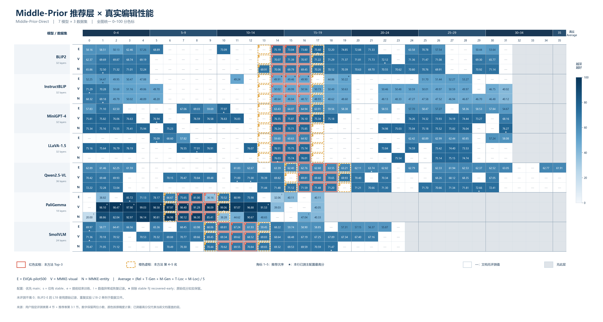
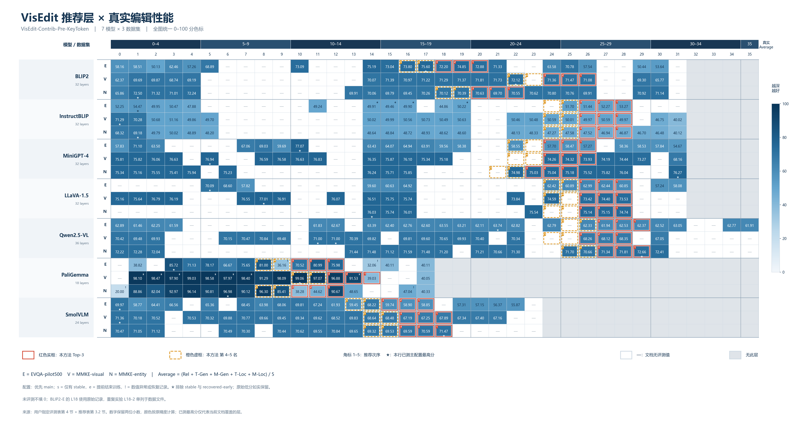
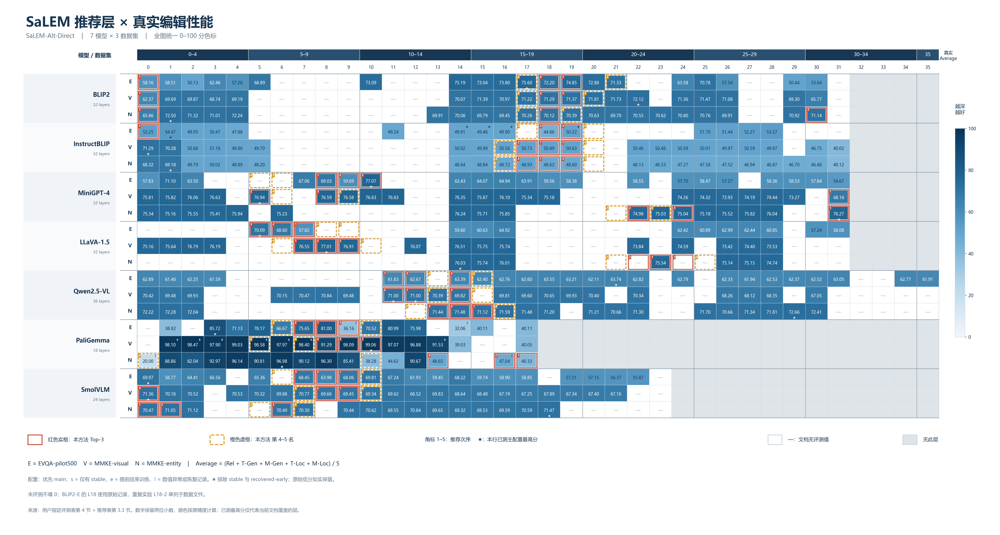
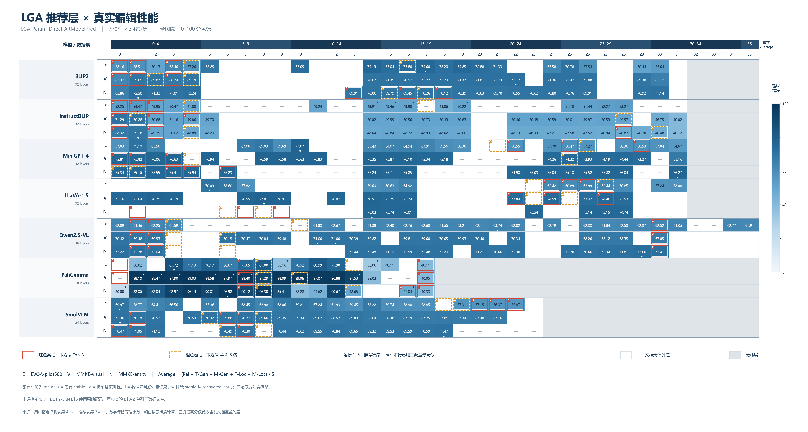
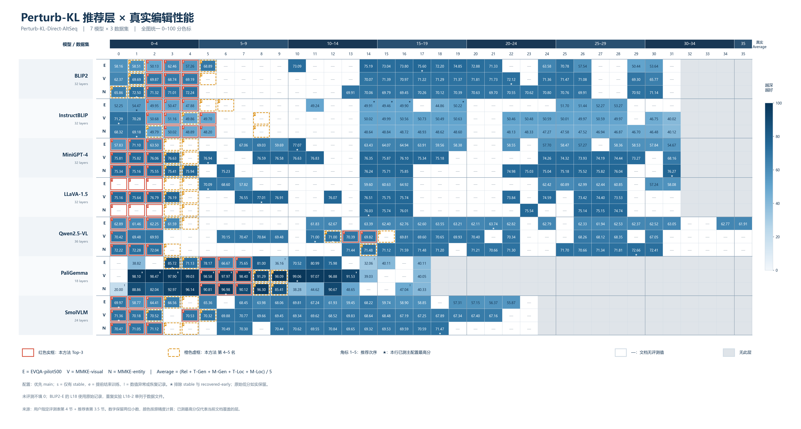

# 各定位方法推荐层 × 真实编辑性能

沿用已确认的 CMA-alt 热力图版式，新增其余六种定位方法及正式 CMA-ModelPred v2，共 7 种方法、14 张图。

所有图使用同一份真实评测矩阵：21 个模型×数据集组合、377 个已评测层；逐条核对，与此前 CMA-alt 图的分数及配置完全一致。

## 下载与浏览

| 方法 | 统一色标 PNG | 行内差异增强 PNG | SVG | PDF |
|---|---|---|---|---|
| Middle-Prior-Direct | [查看](01_middle_prior_editing_heatmap.png) | [查看](01_middle_prior_editing_heatmap_row_relative.png) | [矢量图](01_middle_prior_editing_heatmap.svg) | [矢量图](01_middle_prior_editing_heatmap.pdf) |
| VisEdit-Contrib-Pre-KeyToken | [查看](02_visedit_keytoken_editing_heatmap.png) | [查看](02_visedit_keytoken_editing_heatmap_row_relative.png) | [矢量图](02_visedit_keytoken_editing_heatmap.svg) | [矢量图](02_visedit_keytoken_editing_heatmap.pdf) |
| SaLEM-Alt-Direct | [查看](03_salem_alt_editing_heatmap.png) | [查看](03_salem_alt_editing_heatmap_row_relative.png) | [矢量图](03_salem_alt_editing_heatmap.svg) | [矢量图](03_salem_alt_editing_heatmap.pdf) |
| LGA-Param-Direct-AltModelPred | [查看](04_lga_altmodelpred_editing_heatmap.png) | [查看](04_lga_altmodelpred_editing_heatmap_row_relative.png) | [矢量图](04_lga_altmodelpred_editing_heatmap.svg) | [矢量图](04_lga_altmodelpred_editing_heatmap.pdf) |
| Perturb-KL-Direct-AltSeq | [查看](05_perturb_kl_altseq_editing_heatmap.png) | [查看](05_perturb_kl_altseq_editing_heatmap_row_relative.png) | [矢量图](05_perturb_kl_altseq_editing_heatmap.svg) | [矢量图](05_perturb_kl_altseq_editing_heatmap.pdf) |
| Ours-Direct | [查看](06_ours_direct_editing_heatmap.png) | [查看](06_ours_direct_editing_heatmap_row_relative.png) | [矢量图](06_ours_direct_editing_heatmap.svg) | [矢量图](06_ours_direct_editing_heatmap.pdf) |
| CMA-ModelPred-Direct-v2 | [查看](07_cma_modelpred_v2_editing_heatmap.png) | [查看](07_cma_modelpred_v2_editing_heatmap_row_relative.png) | [矢量图](07_cma_modelpred_v2_editing_heatmap.svg) | [矢量图](07_cma_modelpred_v2_editing_heatmap.pdf) |

行内差异增强版同样提供同名 SVG/PDF。所有 PNG 均为 6160 × 3300 像素。

## 读图口径

- 蓝色越深，真实 Average 越高；统一色标图始终采用 0–100 分，相同格子在所有方法图中的底色一致。
- 红色实框标记当前方法 Top-3，橙色虚框标记第 4–5 名，角标数字是推荐次序。
- 格内数字保留两位小数，着色使用原始精度；★ 是该组合已测主配置中的最高分，仅代表当前文档覆盖的层。
- — 表示源文档无评测值；灰格表示无此层。缺失结果不填 0。
- 优先 main；s 为 stable-only，e 为 recovered-early，! 为数值异常/nonfinite/stall 恢复记录。★ 排除 stable 和 recovered-early。
- BLIP2-E 的 L18 使用原始实验 72.20，L18-2 重复实验 73.34 单独保存在原始数据中，不以取最大值覆盖。
- 行内差异增强版按每行已显示分数的 min/max 归一化；数字仍是真实分数，但不同组合的深浅不能直接比较。
- Ours 采用 M_abscos_x_newn = abs(S_v_cos) × S_v_new_norm。CMA-ModelPred v2 单独展示，未与历史 CMA-alt 混合。
- CMA-ModelPred v2 的 † 保留源文档标记的排名不稳定或低覆盖；具体说明见对应数据 JSON。其他方法不继承 CMA-alt 的低覆盖标记。

## 候选层评测覆盖

以下仅统计有分数的候选数量，包含已标 s 的 stable-only；不是各方法的性能排名。

| 方法 | Top-3 已评测 | Top-5 已评测 |
|---|---:|---:|
| Middle-Prior-Direct | 63/63 | 87/105 |
| VisEdit-Contrib-Pre-KeyToken | 63/63 | 93/105 |
| SaLEM-Alt-Direct | 61/63 | 84/105 |
| LGA-Param-Direct-AltModelPred | 58/63 | 85/105 |
| Perturb-KL-Direct-AltSeq | 57/63 | 80/105 |
| Ours-Direct | 57/63 | 82/105 |
| CMA-ModelPred-Direct-v2 | 57/63 | 79/105 |

## 可复核数据

`shared_evaluation_data.json` 保存所有单元格状态、评测值、配置、源文档行号及完整原始记录。每个方法的 `_data.json` 保存 105 个候选的次序、分数和来源行号。

`manifest.json` 保存输出文件哈希、共用评测矩阵哈希及核验结果；147 组方法×组合候选已同时对照推荐文档的第 3 节与第 4 节。

生成脚本在 `source/` 留档；项目中的可直接执行版本为 `outputs/build_other_localization_heatmaps_20260921.py`。

## 全部统一色标图

### Middle-Prior-Direct

### VisEdit-Contrib-Pre-KeyToken

### SaLEM-Alt-Direct

### LGA-Param-Direct-AltModelPred

### Perturb-KL-Direct-AltSeq

### Ours-Direct

### CMA-ModelPred-Direct-v2

