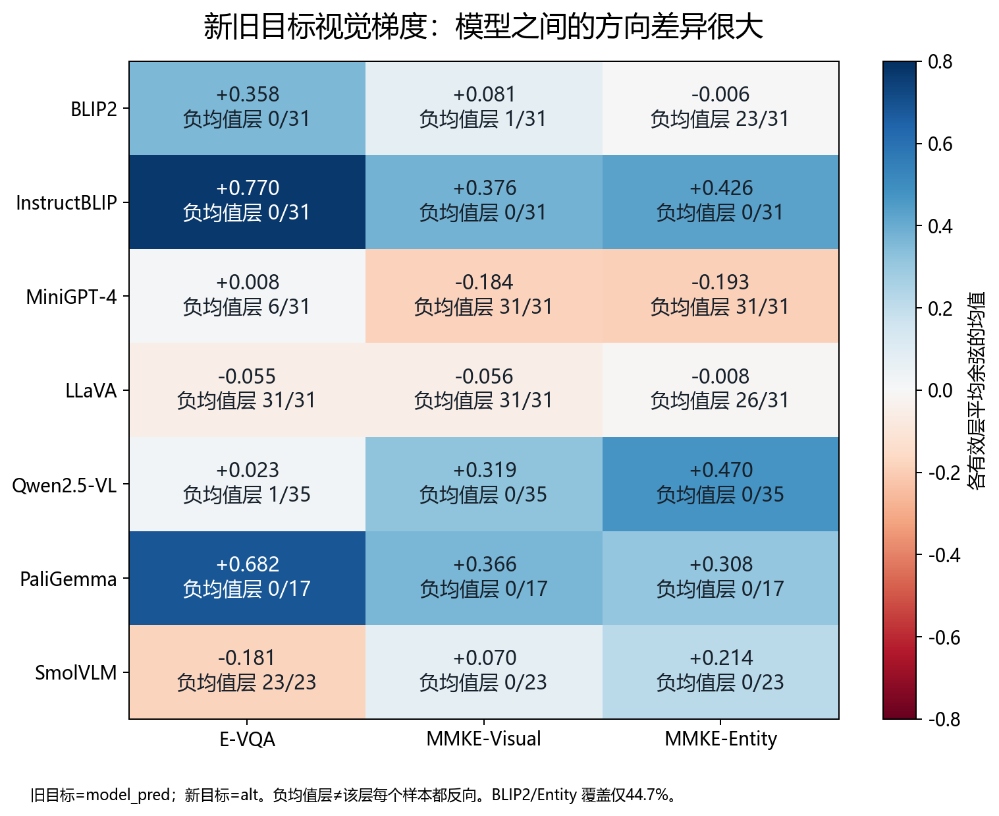
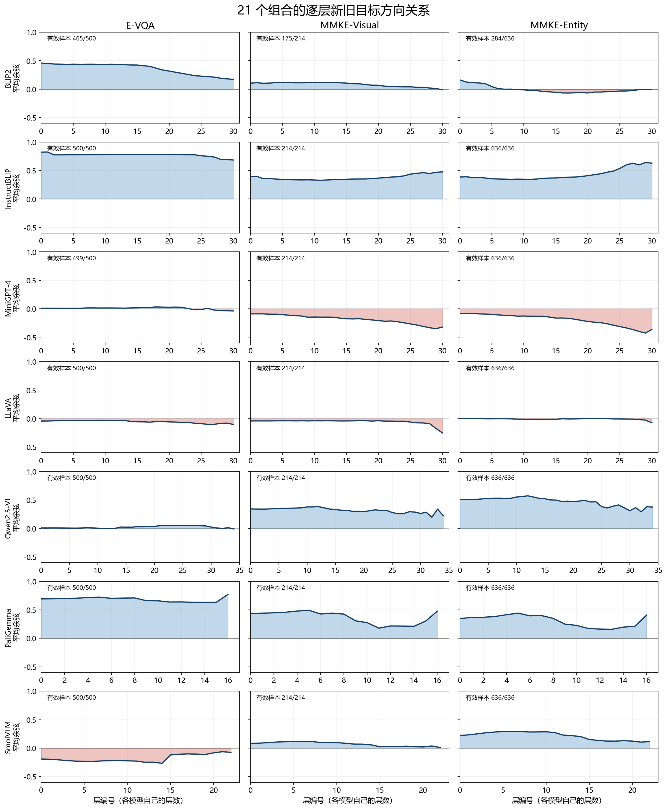
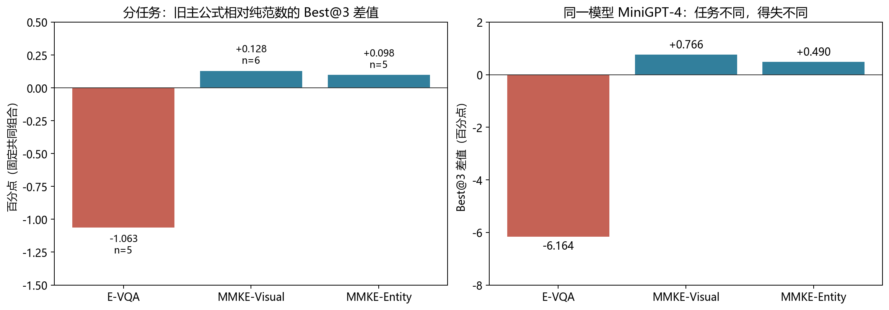

# 三数据集的新旧目标方向关系与任务条件定位分析

日期：2026-09-26。已完成原文核验、服务器21组合档案读取、逐层重算、任务/模型分层比较和留一模型回顾性验证。本轮没有改动训练配置、训练权重或既有实验台账。

## 一、结论

**任务差异需要分析，但现有证据更支持“任务×模型的交互”，不支持简单按三个数据集各指定一个公式。** 反事实编辑并不意味着完整答案的视觉隐藏状态梯度在所有模型、所有层都负相关。分开三个数据集后确实出现方向项得失不同的现象，但优势主要集中在个别模型，按数据集选择公式尚未在留出的模型上带来稳定提升。

当前先保留纯新梯度范数作为参照，并把方向项视为需要由任务条件、当前回答状态和模型实证共同解释的候选信号。不能从“含反事实”直接推导“应使用负余弦定位”。

## 二、三个数据集究竟改变什么

| 本项目数据 | 原任务与编辑对象 | 本地train规模 | 目标答案平均词数/中位数 | 与本轮假设的关系 |
|---|---|---:|---:|---|
| E-VQA pilot500 | 从问答错误出发的图像问答修正，答案较短 | 500 | 1.32 / 1 | 同一记录对新模型未必仍是错误 |
| MMKE-Visual | 动作、手势、属性、关系等视觉语义及规则更新，也含反事实构造 | 214 | 43.91 / 41 | 不能等同于“只修正视觉表征、没有反事实” |
| MMKE-Entity | 实体识别关联与实体描述中的事实更新，含反事实构造 | 636 | 76.06 / 75 | 全文描述同时包含改变和保留的内容 |

MMEdit 的E-VQA来自BLIP-2在VQAv2上的不良预测条目，参见[原论文§3.2](https://aclanthology.org/2023.emnlp-main.856v2.pdf)。MMKE-Bench对视觉实体和视觉语义两类均进行图像替换及反事实文本修改，参见[原论文§3.2–4.2](https://arxiv.org/html/2502.19870v1#S3)。本项目使用的是E-VQA和MMKE的两类任务，不包含MMKE的user-specific知识插入类。

本地实际样本也支持上述区分：E-VQA首条是“Is it sunny?”，数据集旧答案no、目标yes；MMKE-Visual首条将生活手势解释为祈祷手势；MMKE-Entity首条把图中人物关联到Stone Cold Steve Austin，并修改国籍、组织等描述。这里叙述的是编辑目标文本，不认定反事实内容是真实事实。词数按英文单词正则统计，**不是模型token数**。MMKE-Visual的214条数据集`pred`全部为空。

## 三、实际梯度含义与每层结果

目前代码比较的是同一模型的两个完整答案平均NLL梯度：旧目标=`model_pred`，新目标=`alt`。它不是直接比较“数据集真实旧事实”和“反事实新事实”，也不是两个知识向量的夹角。

令 `g_old=∂L_old/∂h_v`，`g_new=∂L_new/∂h_v`。对同一视觉接口作小步更新 `Δh_v=−η g_new`，一阶近似为：

`ΔL_old ≈ −η ⟨g_old,g_new⟩`。

负内积表示在该局部近似下，降低新目标损失会提高旧目标损失；正内积表示两种完整答案损失可能同时下降。这一推导不要求语义互斥目标的隐藏梯度一定反向：隐藏层Jacobian、共享词语和描述格式、不同teacher-forcing上下文都会参与梯度。它也不是训练后真实编辑效果的保证。

下表每格为“各有效层平均余弦的均值；负平均余弦层数/有效层数”。分母排除了无效/零梯度层。

| 模型 | E-VQA | MMKE-Visual | MMKE-Entity |
|---|---:|---:|---:|
| BLIP2 | +0.358；0/31 | +0.081；1/31 | -0.006；23/31 |
| InstructBLIP | +0.770；0/31 | +0.376；0/31 | +0.426；0/31 |
| MiniGPT-4 | +0.008；6/31 | -0.184；31/31 | -0.193；31/31 |
| LLaVA | -0.055；31/31 | -0.056；31/31 | -0.008；26/31 |
| Qwen2.5-VL | +0.023；1/35 | +0.319；0/35 | +0.470；0/35 |
| PaliGemma | +0.682；0/17 | +0.366；0/17 | +0.308；0/17 |
| SmolVLM | -0.181；23/23 | +0.070；0/23 | +0.214；0/23 |

共核验597个有效层条目，其中204个层的平均余弦为负。**层均值为负不等于层内每条样本都反向，负相关也不等于余弦接近−1的严格反向。** LLaVA/Entity的均值仅约−0.008，整体很接近正交。

MMKE-Entity中，InstructBLIP各有效层的平均正内积样本比例约99.96%，PaliGemma约96.36%，Qwen约97.80%，SmolVLM约86.51%；MiniGPT-4约8.55%。这直接否定“反事实样本在不同模型中总是负方向”的普遍命题。

这些正比例来自原脚本逐样本`dot>0`的计数，已保存于`S_v_positive_ratio`。其补数是**非正比例，包含零值**，不能擅自写成严格负方向比例。服务器逐样本日志仅存旧/新答案和损失，没有逐样本dot/cos/norm；本轮没有伪造逐样本分布、分位数、bootstrap方向置信区间，也无法据此重算排除某类样本后的准确方向曲线。

## 四、比数据集名称更值得重视的差异

**1. 模型条件及交互。** 在21个组合等权平均余弦上作平衡两因素描述性分解：模型项约70.5%，数据集项约1.9%，交互剩余约27.6%。这不是因果归因，也不能宣称某种架构解释了70%的机制；模型项同时包含基础能力、生成风格、输入模板等差异。它提示仅按数据集名称分公式可能不足。

例如SmolVLM在E-VQA的23个有效层全部均值为负，在两个MMKE子集却全部为正；MiniGPT-4在E-VQA只有6/31层均值为负，在两个MMKE子集则是31/31。任务条件确实能改变同一模型的方向图谱。

**2. 当前模型可能已经达到目标。** E-VQA中，InstructBLIP有155/500条旧答案与新答案字符串完全一致，PaliGemma有214/500条，BLIP2有效465条中有58条；一致目标会贡献同向梯度。因此它们不能都叫“旧错误到新正确”的冲突请求。即使保守地从余弦总和中扣除每条完全一致答案可能贡献的最大值1，InstructBLIP不一致字符串子集的层平均余弦下界仍约+0.667，PaliGemma仍约+0.445：同向现象不完全由相同答案造成。

**3. 答案格式及长度。** LLaVA/E-VQA完全一致仅5.0%，但忽略大小写/标点后有30.8%一致；SmolVLM相应为0%和32.2%。例如同一个首条目标yes，缓存可能为Yes、yes或一段解释。这些是文本规范化结果，不等价于人工语义准确率。完整序列梯度可能混入格式改写和生成风格的差异，不能全部解释为知识冲突。MMKE长描述则可能由共享内容稀释关键事实变化；现存梯度尚不能把这一机制单独定量分离。

**4. 覆盖与接口。** BLIP2/Entity有效样本284/636（44.7%），BLIP2/Visual为175/214（81.8%），BLIP2/E-VQA为465/500（93.0%）。低覆盖不能代表整个任务；主要公式评估要求覆盖≥80%。每个模型最后一层在该输出hook口径下无有效视觉梯度，不能解释为“末层没有知识”，也不能与正负方向层混算。

**5. 样本聚合会抵消方向。** 现有主公式计算的是`abs(mean(cos_i)) × mean(new_norm_i)`，不是`mean(abs(cos_i) × new_norm_i)`。层平均余弦接近零，可能来自样本本身近似正交，也可能来自正负样本互相抵消；单看均值无法区分。尤其不能把数据集平均方向当作某条编辑请求的方向。逐样本方向未保存，是检验样本分层和任务条件公式的实际数据缺口。

## 五、混合汇总是否掩盖公式优势

有局部掩盖，但目前并非分开任务后出现大范围明确优势。以三种核心规则共同具备Top-3评测且定位覆盖≥80%的组合为固定样本：E-VQA为5组，Visual为6组，Entity为5组，共16组。下表是相对纯新梯度范数的百分点变化。

| 数据集 | 共同组合数 | 绝对余弦×范数：Best@3变化 | Mean@3变化 | (1−余弦)×范数：Best@3变化 |
|---|---:|---:|---:|---:|
| E-VQA | 5 | -1.063 | -0.440 | +0.000 |
| MMKE-Visual | 6 | +0.128 | +0.130 | -3.355 |
| MMKE-Entity | 5 | +0.098 | +0.089 | -3.832 |

这些是原main实际运行口径，保留数值异常/中断恢复成绩，含本轮前已完成的PaliGemma Visual L3/L5；不混入stable。它不等同于每层均完成50轮训练。另保存了15组的旧冻结clean口径作敏感性比较。E-VQA中InstructBLIP/LLaVA的相关Top-3缺层、MMKE两个子集LLaVA的部分候选缺层、以及BLIP2/Entity低覆盖限制了主要比较范围，逐组缺失见CSV。

在这16组中，主公式与纯范数有12组Top-3集合相同，只有4组不同；两个MMKE任务中主公式Best@3的正增益都来自**MiniGPT-4**。因此总体胜率小，既可能有任务异质性，也因为多数时候两公式根本没有推荐不同的集合。不能把每个正均值称作跨模型优势。

进一步固定MiniGPT-4，观察不同任务的实际取舍：

| 任务 | 纯范数Top-3 | 绝对余弦×范数Top-3 | Best@3变化 | Rel变化 | M-Gen变化 | M-Loc变化 |
|---|---|---|---:|---:|---:|---:|
| E-VQA | 0,1,2 | 18,19,16 | -6.164 | -11.97 | -12.80 | +6.10 |
| MMKE-Visual | 0,1,2 | 9,10,11 | +0.766 | +1.68 | +1.33 | -0.56 |
| MMKE-Entity | 0,1,2 | 27,28,26 | +0.490 | +0.77 | +0.89 | -0.04 |

Rel/M-Gen/M-Loc差值取各自Top-3中Average最高的那一层，**同一行使用同一个checkpoint**，没有把不同层的分项最高分拼在一起。E-VQA中方向项虽让M-Loc提高6.10点，却让Rel下降11.97点、M-Gen下降12.80点；MMKE中的增益则小得多。这说明应解释“编辑能力与局部性如何变化”，不能只数一次赢或输。

完整的八种机制对照及每个分项与真实扫层表现的Spearman相关性已输出。相关性仅基于已测候选层，不能冒称全网络扫层；不同分项的best指标可能来自不同层，所以报告正文采用上述同一checkpoint分解。

下面进一步对各模型已测层计算Spearman，再等权平均模型相关系数。它覆盖有至少5个已测有效层、定位覆盖≥80%的模型，所以比Top-3完整候选比较多纳入部分模型，分母不同：

| 数据集 | 指标 | 可用模型数 | 平均ρ：Average | 平均ρ：Rel | 平均ρ：M-Gen | 平均ρ：M-Loc |
|---|---|---:|---:|---:|---:|---:|
| E-VQA | 纯新范数 | 7 | +0.190 | +0.378 | +0.371 | -0.226 |
| E-VQA | 绝对余弦×新范数 | 7 | +0.267 | +0.276 | +0.339 | -0.040 |
| MMKE-Visual | 纯新范数 | 7 | +0.396 | +0.451 | +0.434 | -0.023 |
| MMKE-Visual | 绝对余弦×新范数 | 7 | +0.322 | +0.384 | +0.360 | -0.115 |
| MMKE-Entity | 纯新范数 | 6 | +0.441 | +0.403 | +0.403 | +0.331 |
| MMKE-Entity | 绝对余弦×新范数 | 6 | +0.306 | +0.265 | +0.272 | +0.059 |

例如在两个MMKE任务中，纯范数对Rel及M-Gen的平均排序关联更强，不能因主公式Best@3平均略高就宣称方向项整体更可信。相关性描述的是已有候选池中的排序，不是因果效应，也没有把模型之间不同尺度的原始梯度范数直接混合回归。MMKE完整长描述的token成绩还需要关键事实正确性核验，不能把大量保留词语的得分直接理解为反事实修改成功。

## 六、已执行的任务选择器检验

候选规则固定为 `n`、`|c|n`、`(1−c)n`。每轮留出一个模型的全部数据集，统一选择器用其他模型的所有任务选公式，任务选择器仅用其他模型的同一任务选公式。各候选使用相同训练组合，平分优先纯范数；Top-1、Best@3、Mean@3分别按各自目标选择。以下是留出结果，而非在同一表里逐组挑赢家：

| 选择目标 | 留出组合数 | 分任务选择−统一选择 | 分任务选择−固定纯范数 |
|---|---:|---:|---:|
| Top-1 Average | 18 | -0.921 | -2.948 |
| Best@3 | 16 | -0.079 | -0.385 |
| Mean@3 | 16 | -0.077 | -0.199 |

**当前简单的“按数据集选择公式”没有提高整体留出表现。** Best@3在16组中相对统一选择为0胜、14平、2负，均值−0.0785点；在旧冻结clean口径15组上也没有改善。一个具体原因是：留出MiniGPT-4后，两个MMKE任务其余模型上的方向项优势消失，选择器便回到纯范数，恰好失去MiniGPT-4上的收益。说明这是任务与模型交互，现有小样本不足以学成可迁移的数据集规则。

扩大到七种规则时，共同候选覆盖显著下降，只有4个可执行的Top-1留出案例、Top-3不足以开展同等规模比较；不能挑出这一小表的正差值宣称任务自适应成功。本轮是已经查看过这些数据后的**回顾性检验**，不是独立测试，也不能排除将来存在更好的任务条件方法。按模型聚类的bootstrap区间仅作小样本稳定性描述，不是最终显著性证明。

## 七、下一步应验证什么

建议研究对象从“数据集名称决定公式”改成“编辑请求状态、任务结构与模型条件共同决定定位信号是否有用”，先做下列最小诊断，保留现有训练结果不动：

1. **补齐逐样本梯度记录，而非重训编辑器。** 在现有定位脚本的附加诊断输出中保存每样本每层的dot、cos、旧/新范数、零梯度标志、有效mask、旧/新目标token数、样本ID。现有日志无法回推出这些值；新增实算属于后续GPU诊断，本轮没有把它写成已完成。
2. **按可在定位前识别的状态分层。** 原回答已匹配目标；对象识别/属性纠错；实体关联替换；属性或规则反事实替换；混合长描述。对匹配状态分别保存严格字符串、规范化字符串和人工语义标记，不能用同一粗糙字符串规则替代所有判断。
3. **先控制目标定义与格式。** 保留原完整序列结果作为基准，另比较格式对齐的目标、关键事实片段损失、完整序列损失；旧答案统一来自当前模型。MMKE-Visual没有可直接用的原`pred`，需要从原始知识记录回溯并核验，不能编造旧事实。
4. **优先研究有相反现象的固定模型，而非只选胜例。** MiniGPT-4、SmolVLM跨任务变号；InstructBLIP与LLaVA提供同向/负向对照。若做pilot，应按样本ID固定抽样并覆盖全部任务及上述状态，不根据已知编辑成绩挑样本。首轮可固定每组30条请求，明确是诊断而非决定论文主公式的小样本。
5. **分开“更新成功”和“边界保持”。** 当前新旧目标方向只观察编辑请求自身；局部性来自无关请求，不能把两目标夹角直接叫作反事实边界测量。若要刻画边界，需加入固定无关/邻域控制请求的敏感性或梯度测量，并以M-Loc及泛化分项验证。
6. **冻结规则后再验证。** 若从诊断中形成一个有限、可解释的条件规则，在开发模型上确定，随后留出模型/新样本进行确认；缺候选评测按预先固定并集补齐。报告Best@3、Mean@3、Top-1、Rel/M-Gen/M-Loc与失败率，不能为某公式单独换训练配方。

这条路线允许“不同任务适合不同定位方法”成为可检验假设，但当前还不能把它写成已证实结论，更不能只根据这个假设再次寻找有利胜率。

## 八、交付与复核

- `分析计划.md`：本轮执行边界与方案。
- `group_direction_summary.csv`、`layer_direction.csv`：21组合及全部逐层方向、覆盖和正比例。
- `sample_target_audit.csv`、`dataset_semantics_summary.csv`、`fixed_examples.json`：真实目标来源、长度、一致性与固定样例；不包含伪造的逐样本余弦。
- `candidate_topk.csv`、`observed_main_outcomes.csv`、`formula_metrics.csv`、`dataset_formula_summary.csv`、`layerwise_correlations.csv`：候选、实际结果、分任务和分项分析。
- `leave_model_out_cases.csv`、`leave_model_out_summary.csv`：可追溯的留出选择与结果。
- `source_manifest.json`、`inputs/`：服务器只读取回的压缩来源已逐项校验SHA-256，21份逐层CSV关键数值与本地原归档一致。Qwen使用chatfix修复版；其余六模型使用原正式目录。
- 复现顺序：`unpack_and_preview.py`（解包及冻结快照）、`analyze.py`（计算）、`plot_and_report.py`（图与本文）。不修改原始实验台账。
